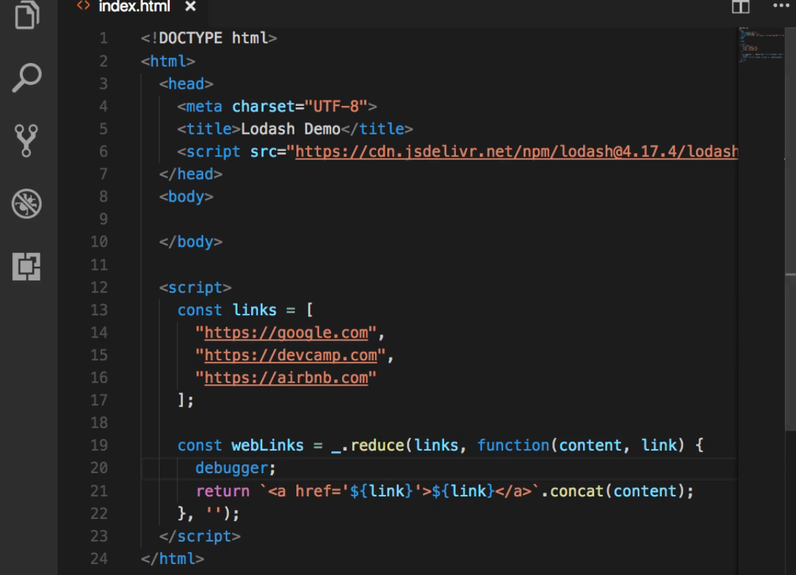
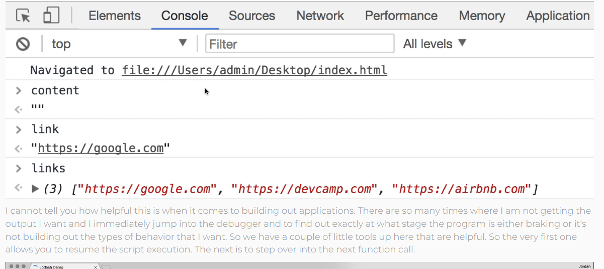
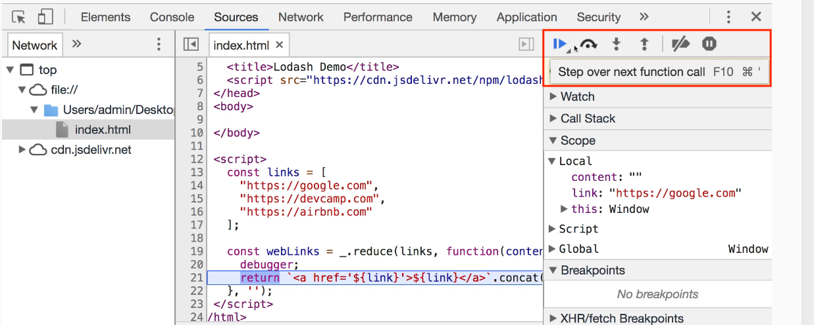
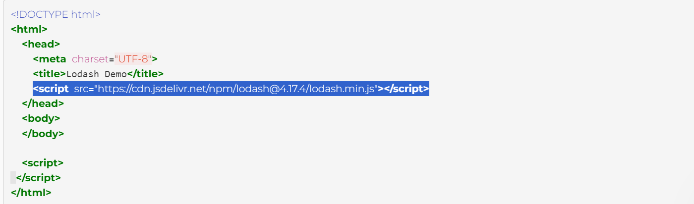

# APUNTES JAVASCRIPT

## 1.- ¿Qué diferencia a Javascript de cualquier otro lenguaje de programación?

Algunas de las diferencias entre JavaScript y otros lenguajes:

__1.-__ Es un __lenguaje de programación interpretado__ que se ejecuta en el navegador del cliente, lo que lo convierte en un lenguaje fundamental para el desarrollo web.

Un lenguaje interpretado es aquel cuyas instrucciones son ejecutadas directamente por un programa llamado intérprete. En este proceso, el intérprete lee línea por línea el código fuente y lo traduce a instrucciones ejecutables de forma inmediata. Esto significa que no se necesita compilar el código antes de ejecutarlo, lo que facilita el proceso de desarrollo y depuración.

Por otro lado, existen los lenguajes compilados. Son lenguajes cuyo código fuente se traduce por completo a un lenguaje de máquina específico para el hardware de la computadora mediante un programa llamado compilador. Este proceso genera un archivo ejecutable que puede ser ejecutado posteriormente sin necesidad de volver a traducir el código fuente. Los lenguajes compilados tienden a ser más rápidos en la ejecución, pero a menudo requieren más pasos y tiempo de desarrollo debido al proceso de compilación.

__2.-__ Es un __lenguaje multiparadigma__, lo que significa que soporta programación orientada a objetos, programación funcional y programación imperativa.
  
#### `Programación Orientada a Objetos (POO):`

En la programación orientada a objetos, organizamos nuestro código en "objetos", que son como bloques de construcción. Construimos nuestro código utilizando "objetos" como unidades fundamentales. 

Imagina que estás construyendo una casa con bloques de Lego. Cada bloque de Lego es como un objeto en la programación orientada a objetos. Puedes tener bloques de diferentes formas, tamaños y colores, y los ensamblas para construir una estructura más grande y compleja, como una casa. Cada objeto tiene propiedades (cosas que describe) y métodos (acciones que puede realizar). Piensa en los objetos como objetos del mundo real: un coche, una persona o una casa. Cada uno tiene características específicas y puede hacer ciertas cosas.

Por ejemplo, podríamos tener un objeto "Coche" con propiedades como color, marca y modelo, y métodos como "arrancar" o "detenerse". Este enfoque nos permite organizar nuestro código de manera más intuitiva y reutilizable.

Ejemplo en JavaScript:

```javascript
// Definición de una clase Persona
class Persona {
  constructor(nombre, edad) {
    this.nombre = nombre;
    this.edad = edad;
  }
// Método que define lo que hace una persona cuando saluda y se presenta
  saludar() {
    console.log(`Hola, mi nombre es ${this.nombre} y tengo ${this.edad} años.`);
  }
}
// Creación de un objeto persona
const persona1 = new Persona("Juan", 30);

// Llamada a método saludar()
persona1.saludar();
```

#### `Programación Funcional:`

La programación funcional se centra en el uso de funciones como bloques de construcción fundamentales. En este estilo de programación, las funciones son tratadas como valores y pueden pasarse como argumentos a otras funciones o devolverse como resultados de funciones. Las funciones en la programación funcional son "puras", lo que significa que siempre producen el mismo resultado para los mismos datos de entrada y no tienen efectos secundarios.

Por ejemplo, podríamos tener una función "duplicar" que toma un número como entrada y devuelve el doble de ese número. Esta función no cambia ningún estado ni tiene efectos secundarios, simplemente realiza una operación basada en su entrada y devuelve un resultado.

Ejemplo en JavaScript:


```javascript
// Función que suma dos números
function suma(a, b) {
  return a + b;
}

// Función que multiplica dos números
function multiplicar(a, b) {
  return a * b;
}

// Uso de funciones como argumentos
function operacion(a, b, callback) {
  return callback(a, b);
}

// Uso de la función operacion con las funciones suma y multiplicar
console.log(operacion(5, 3, suma)); // Output: 8
console.log(operacion(5, 3, multiplicar)); // Output: 15
```

#### `Programación Imperativa:`

La programación imperativa se basa en la ejecución de instrucciones paso a paso. En este estilo de programación, escribimos código que especifica exactamente cómo se deben realizar las operaciones. Nos centramos en "cómo" se deben hacer las cosas en lugar de en "qué" se debe hacer.

Por ejemplo, podríamos tener un conjunto de instrucciones que describen cómo hacer una taza de té: "calentar el agua", "poner la bolsita de té en la taza", "verter el agua caliente sobre la bolsita de té", etc. Cada instrucción se ejecuta secuencialmente y cambia el estado del programa a medida que avanza.

Ejemplo en JavaScript:

```javascript
// Función que calcula el factorial de un número de forma imperativa
function factorial(n) {
  let resultado = 1;
  for (let i = 1; i <= n; i++) {
    resultado *= i;
  }
  return resultado;
}

// Uso de la función factorial
console.log(factorial(5)); // Output: 120
```

__3.-__ Es un __lenguaje de tipado dinámico,__ lo que significa que las variables no están asociadas a un tipo de dato específico y pueden cambiar de tipo durante la ejecución del programa. No necesitas declarar explícitamente el tipo de una variable al crearla. El tipo de la variable se determina automáticamente en tiempo de ejecución, según el valor que se le asigna en ese momento.

Un ejemplo simple:

```javascript
// Declaración de una variable 'x' sin especificar su tipo
let x;

// Asignación de un valor entero a la variable 'x'
x = 5;

// La variable 'x' ahora es de tipo número (integer)
console.log(typeof x); // Output: number

// Asignación de un valor string a la variable 'x'
x = "Hola mundo";

// La variable 'x' ahora es de tipo string
console.log(typeof x); // Output: string
```

__4.-__ Es un __lenguaje que sigue el modelo de eventos y callback,__ lo que lo hace especialmente adecuado para la creación de aplicaciones web interactivas y asincrónicas.

__`Modelo de Eventos en JavaScript:`__

JavaScript es un lenguaje de programación basado en eventos. Esto significa que gran parte de la programación en JavaScript implica esperar y responder a eventos que ocurren en el navegador (como hacer clic en un botón, cargar una página, mover el mouse, etc.). En lugar de ejecutar instrucciones de manera secuencial de arriba a abajo, el código JavaScript espera eventos y responde a ellos.

__`Callbacks en JavaScript:`__

Los callbacks son funciones que se pasan como argumentos a otras funciones. Estas funciones se ejecutarán una vez que se complete una operación asíncrona o un evento ocurra. En JavaScript, los callbacks son una forma común de manejar operaciones asíncronas.

Ejemplo: Manejando un evento de clic con un Callback en JavaScript:

Supongamos que tenemos un botón en nuestro HTML con el id "miBoton" y queremos ejecutar una función cuando se haga clic en ese botón.

```javascript
<!DOCTYPE html>
<html>
<head>
    <title>Ejemplo de Callbacks en JavaScript</title>
</head>
<body>

<button id="miBoton">Haz clic aquí</button>

<script>
    <!--Definimos una función que será nuestro callback-->
    function manejarClic() {
        console.log("¡El botón fue clickeado!");
    }

    <!--Seleccionamos el botón y agregamos un event listener-->
    document.getElementById("miBoton").addEventListener("click", manejarClic);
</script>

</body>
</html>
```

En este ejemplo:

* Definimos una función llamada manejarClic que lo que hace es imprimir un mensaje en la consola cuando se llama.
* Seleccionamos el botón con el ID "miBoton" usando document.getElementById.
* Utilizamos el método addEventListener para adjuntar un event listener al botón. Este método escucha el evento de clic y llama a la función manejarClic cuando se produce el evento.
  

__5.-__ Dispone de una __amplia gama de bibliotecas y frameworks,__ como Node.js, React.js, Angular.js, entre otros, que permiten extender sus capacidades y facilitar el desarrollo de aplicaciones complejas.

__Bibliotecas en JavaScript:__

Una biblioteca en JavaScript es un conjunto de funciones y métodos predefinidos que se pueden utilizar para realizar tareas específicas de manera más fácil y eficiente. Estas funciones suelen abordar problemas comunes en el desarrollo web, como manipulación del DOM (Document Object Model), animaciones, manejo de eventos, comunicación con servidores, entre otros. Ejemplos populares de bibliotecas JavaScript incluyen jQuery, lodash, moment.js, Axios, entre otros. Estas bibliotecas simplifican el desarrollo al proporcionar una interfaz consistente y funcionalidades probadas que se pueden reutilizar en múltiples proyectos.

__Frameworks en JavaScript:__

Un framework en JavaScript es un conjunto más completo de herramientas, patrones y convenciones para el desarrollo de aplicaciones web. A menudo, los frameworks ofrecen una estructura y arquitectura predefinida para organizar el código, manejar el enrutamiento, gestionar el estado de la aplicación, realizar solicitudes al servidor, entre otras tareas. Los frameworks en JavaScript son especialmente útiles para el desarrollo de aplicaciones web complejas y de gran escala. Ejemplos populares de frameworks JavaScript incluyen AngularJS, React.js, Vue.js, Express.js, entre otros.

__Diferencias:__

La principal diferencia entre una biblioteca y un framework radica en el control que tienen sobre el flujo de la aplicación. Con una biblioteca, el desarrollador tiene más control y decide cuándo y cómo utilizar las funciones proporcionadas por la biblioteca. En cambio, con un framework, el desarrollador debe seguir la estructura y las convenciones establecidas por el framework, lo que puede limitar la flexibilidad pero simplificar el desarrollo al proporcionar una guía clara sobre cómo construir la aplicación.

__6.-__ Es __ampliamente utilizado en el desarrollo de aplicaciones web,__ desde la creación de páginas estáticas hasta aplicaciones web dinámicas y complejas. Es ampliamente utilizado, debido a su versatilidad y su capacidad para interactuar dinámicamente con el contenido de una página web. Aquí hay algunos conceptos y tecnologías relacionadas con el desarrollo web en JavaScript que son ampliamente utilizados:

* `DOM Manipulation (Manipulación del DOM):` El DOM (Document Object Model) es una representación del contenido de un documento HTML/XML que JavaScript puede manipular dinámicamente para cambiar la estructura, el estilo y el contenido de una página web. La manipulación del DOM es fundamental para crear interacciones dinámicas en una página web, como actualizar elementos en respuesta a eventos del usuario.

* `AJAX (Asynchronous JavaScript and XML):` AJAX es una técnica que permite enviar y recibir datos desde un servidor en segundo plano, sin interferir con la navegación y la visualización de la página web. Permite actualizar partes específicas de una página sin tener que recargarla por completo. Esto se logra utilizando objetos como XMLHttpRequest o, más recientemente, utilizando las funciones de la API Fetch.

* `Frameworks de Frontend:` Los frameworks de frontend proporcionan una estructura y un conjunto de herramientas para facilitar el desarrollo de aplicaciones web complejas. Algunos de los frameworks de frontend más populares son:

  1. __React.js:__ Desarrollado por Facebook, React.js es una biblioteca de JavaScript para construir interfaces de usuario interactivas y reutilizables.. 
  2. __AngularJS/Angular:__ Mantenido por Google, Angular es un framework de desarrollo de aplicaciones web y móviles que ofrece una solución completa para la construcción de aplicaciones frontend.
  3. __Vue.js:__ Vue.js es un framework progresivo de JavaScript para la construcción de interfaces de usuario interactivas. Es conocido por su enfoque incremental y su facilidad de integración con proyectos existentes.

* `Gestión de Estado:` En aplicaciones web complejas, puede ser necesario gestionar el estado de la aplicación de manera eficiente. Para esto, se utilizan bibliotecas y patrones de gestión de estado como Redux (para React.js), Vuex (para Vue.js), y RxJS (para Angular), entre otros.

* `Herramientas de Desarrollo:` Existen numerosas herramientas de desarrollo en JavaScript que facilitan la escritura, prueba y depuración de código, así como la optimización del rendimiento de las aplicaciones web. Algunas de estas herramientas incluyen webpack para empaquetar y optimizar recursos, Babel para transpilar código, ESLint para análisis estático de código, y muchas otras.

## 2.- Hoisting

hoisting es un comportamiento en el que las declaraciones de variables (ya sea con var, let o const) y funciones son movidas al inicio de su ámbito actual durante la fase de compilación, pero su asignación de valor permanece en su lugar original. Esto puede causar comportamientos inesperados si no se comprende correctamente.

```javascript
// Hoisted
name = 'Kristine';
console.log(name); // 'Kristine'
var name;
```` 

Es importante tener en cuenta que el hoisting solo eleva la declaración de variables y funciones, no sus asignaciones o inicializaciones. Ejemplo en el que no funcionaría y daría un error undefine:

```javascript
// Initializers not hoisted
console.log(age); // undefined
var age = 33;

```

## 3.- ¿Cuáles son algunos tipos de datos JS?

1. **Primitivos:**
   - __Number:__ Representa números, tanto enteros como de punto flotante.
     ```javascript
     let edad = 25;
     let precio = 10.99;
     ```

   - __String:__ Representa cadenas de texto.
     ```javascript
     let nombre = "Juan";
     let mensaje = 'Hola, mundo!';
     ```

   - __Boolean:__ Representa un valor lógico verdadero o falso.
     ```javascript
     let esMayor = true;
     let esMenor = false;
     ```

   - __Null:__ Representa un valor nulo o vacío.
     ```javascript
     let valor = null;
     ```

   - __Undefined:__ Representa un valor no definido.
     ```javascript
     let variableNoDefinida;
     ```

   - __Symbol:__ (Añadido en ECMAScript 6) Representa un identificador único e inmutable.
     ```javascript
     const simbolo = Symbol('descripcion');
     ```

2. __Objetos:__
   - __Object:__ Representa un objeto, que puede contener propiedades y métodos.
     ```javascript
     let persona = { nombre: "Ana", edad: 30 };
     ```

   - __Array:__ Representa una lista ordenada de elementos.
     ```javascript
     let numeros = [1, 2, 3, 4, 5];
     ```

   - __Function:__ Representa una función en JavaScript.
     ```javascript
     function saludar(nombre) {
         console.log("Hola, " + nombre + "!");
     }
     ```

   - __Date:__ Representa una fecha y hora.
     ```javascript
     let fechaActual = new Date();
     ```

   - __RegExp:__ Representa una expresión regular para buscar patrones en cadenas de texto.
     ```javascript
     let expresionRegular = /[a-z]+/g;
     ```

   - __Map:__ Representa una colección de pares clave/valor.
     ```javascript
     let mapa = new Map();
     mapa.set("clave", "valor");
     ```

   - __Set:__ Representa una colección de valores únicos.
     ```javascript
     let conjunto = new Set();
     conjunto.add(1);
     conjunto.add(2);
     ```

## 4.- Declaración de Variables

__var:__ Esta fue la forma original de declarar variables en JavaScript. Sin embargo, debido a algunas características no deseadas de var, como el hoisting y el alcance de función, se recomienda usar let o const en su lugar.

__let:__ Introducida en ECMAScript 6 (también conocido como ES6 o ES2015), let permite declarar variables que están limitadas al ámbito del bloque en el que se definen. Esto significa que su alcance se limita al bloque, la declaración o la expresión en la que están definidos.

__const:__ También introducida en ECMAScript 6, const se utiliza para declarar variables cuyos valores no cambiarán. Una vez que se asigna un valor a una variable const, no se puede reasignar a otro valor.

__Undefined:__ Para representar una variable que no tiene un valor asignado.

```javascript
let x;
```
__Null:__ Para representar la ausencia de valor.

```javascript
let y = null;
```

__Symbol:__ Para crear valores únicos e inmutables, a menudo utilizados como claves de propiedades de objetos.

```javascript
const mySymbol = Symbol();
```
Estos son algunos de los tipos de variables y datos más comunes en JavaScript.

### Diferencias entre const, let y var

#### const

- Se utiliza para declarar constantes cuyo valor no cambiará después de su inicialización.
- No se puede reasignar a un nuevo valor después de la inicialización.
- El alcance de una constante declarada con `const` es el bloque en el que se declara.
- Se debe inicializar una constante al momento de su declaración.
- Es una buena práctica utilizar `const` para declarar variables que no necesitan ser reasignadas.
- No sufre hoisting, por lo que no puede ser utilizado antes de ser declarado dentro de su ámbito.

Ejemplo:

```javascript
    const PI = 3.14159;
    const person = { name: "John", age: 30 };

    console.log(PI); // 3.14159
    console.log(person.name); // John

    // Dará un error, ya que no se puede reasignar una variable constante
    // PI = 3.14; // Error: Assignment to constant variable

    // Sin embargo, si la variable constante es un objeto, su contenido puede cambiar
    person.age = 31;
    console.log(person.age); // 31
```

#### let

- Se utiliza para declarar variables cuyo valor puede cambiar.
- El alcance de una variable declarada con `let` es el bloque en el que se declara.
- Puede ser reasignado a un nuevo valor después de su inicialización.
- No se puede redeclarar en el mismo alcance.
- Es una buena práctica utilizar `let` en lugar de `var` para declarar variables con alcance de bloque.
- No sufre hoisting, por lo que no puede ser utilizado antes de ser declarado dentro de su ámbito.

Ejemplo:

```javascript
    function example() {
    let x = 10;
    if (true) {
        let y = 20;
        console.log(x); // 10
        console.log(y); // 20
    }
    console.log(x); // 10
    // Dará error porque es declarada dentro del bloque if y está fuera del alcance (scope)
    // console.log(y); // Error: y is not defined
    }

    example();
```

#### var

- Se utilizaba para declarar variables antes de la introducción de `const` y `let`.
- El alcance de una variable declarada con `var` es la función contenedora o el archivo si está fuera de cualquier función (esto se conoce como ámbito de función o global).
- Puede ser reasignado a un nuevo valor después de su inicialización.
- Se puede redeclarar en el mismo alcance, lo que puede llevar a errores difíciles de detectar.
- No es recomendado su uso en la mayoría de los casos debido a su comportamiento de ámbito menos predecible y propenso a errores.
- Sufre hoisting, lo que significa que puede ser utilizado antes de ser declarado, aunque su valor será undefined si se accede a él antes de la declaración.

```javascript
    function example() {
        var x = 10;
        if (true) {
            var y = 20;
            console.log(x); // 10
        }
        console.log(y); // 20
    }

    example();
```

## 5.- Conocer el tipo de dato que es 

```javascript
typeof 12; // "number"

typeof 'Astros'; // "string"

typeof true; // "boolean"

typeof { name: "Kristine" }; // "object"

var age; // undefined

typeof age; // "undefined"  

age = null; // null

typeof age; // "object"

Nota: Para imprimir por consola console.log(typeof nombre_variable);

```

## 6.- Operaciones con dos variables:

__Dos variables del mismo tipo__

Adición (+):

```javascript
let num1 = 5;
let num2 = 3;
let suma = num1 + num2; // Resultado: 8
```

Multiplicación (*):

```javascript
let num1 = 4;
let num2 = 3;
let producto = num1 * num2; // Resultado: 12
```

__Operaciones con una variable numérica y otra como cadena (string):__

Adición (+):

```javascript
let num = 5;
let cadena = "3";
let concatenacion = num + cadena; // Resultado: "53"
```
Otro djemplo para que en lugar de unir realmente lo sume puede ser este:

```javascript
let variable1 = 5;
let variable2 = "3";

// Verificar si una de las variables es una cadena
if (typeof variable1 === "string" || typeof variable2 === "string") {
    // Convertir las cadenas a números si es necesario
    if (typeof variable1 === "string") {
        variable1 = parseInt(variable1);
    }
    if (typeof variable2 === "string") {
        variable2 = parseInt(variable2);
    }
}

// Sumar las dos variables
let suma = variable1 + variable2; // Si una de las variables es una cadena, se sumarán como números

console.log(suma); // Imprimirá 8 en lugar de "53"
```

Resta (-):

```javascript
let num = 10;
let cadena = "5";
let resta = num - cadena; // Resultado: 5 (cadena se convierte en número y se resta de num)
```

Multiplicación (*):

```javascript
let num = 4;
let cadena = "3";
let producto = num * cadena; // Resultado: 12 (cadena se convierte en número y se multiplica por num)
```

División (/):

```javascript
let num = 12;
let cadena = "3";
let division = num / cadena; // Resultado: 4 (cadena se convierte en número y se divide de num)
```
Módulo (%):

```javascript
let num = 10;
let cadena = "3";
let modulo = num % cadena; // Resultado: 1 (cadena se convierte en número y se toma el módulo de num)
```

## 7.- Transformar variables (Cambio de tipos)

### Transformar un número a una cadena:

```javascript
let numero = 123;
let cadena = numero.toString(); // Transforma el número 123 en la cadena "123"
let cadena = String(numero); // Otra forma
console.log(cadena); // Imprimirá "123"
```
### Transformar una cadena a un entero:


```javascript
let cadena = "456";
let numero = parseInt(cadena); // Transforma la cadena "456" en el número 456
console.log(numero); // Imprimirá 456
```

### Transformar un entero en un float:

Transformar un entero en un float:

```javascript
let entero = 5;
let flotante = parseFloat(entero); // Transforma el entero 5 en el flotante 5.0
console.log(flotante); // Imprimirá 5.0
```

Transformar un float en un entero:

```javascript
let flotante = 5.75;
let entero = parseInt(flotante); // Transforma el flotante 5.75 en el entero 5
console.log(entero); // Imprimirá 5
```

## Funciones Javascript
| __Name__              | __Description__                                                                                  |
|-----------------------|--------------------------------------------------------------------------------------------------|
|   charAt()            | Returns the character at a specified index (position)                                            | 
|   charCodeAt()	    | Returns the Unicode of the character at a specified index                                        |
|   concat()	        | Returns two or more joined strings                                                               |
|   constructor	        | Returns the string's constructor function                                                        |
|   endsWith()	        | Returns if a string ends with a specified value                                                  |
|   fromCharCode()	    | Returns Unicode values as characters                                                             |
|   includes()	        | Returns if a string contains a specified value                                                   |
|   indexOf()	        | Returns the index (position) of the first occurrence of a value in a string                      |
|   lastIndexOf()	    | Returns the index (position) of the last occurrence of a value in a string                       |
|   length	            | Returns the length of a string                                                                   |
|   localeCompare()	    | Compares two strings in the current locale                                                       |
|   match()	            | Searches a string for a value, or a regular expression, and returns the matches                  |
|   prototype	        | Allows you to add properties and methods to an object                                            |
|   repeat()	        | Returns a new string with a number of copies of a string                                         |
|   replace()	        | Searches a string for a pattern, and returns a string where the first match is replaced          |
|   replaceAll()	    | Searches a string for a pattern and returns a new string where all matches are replaced          |
|   search()	        | Searches a string for a value or regular expression and returns the index (position) of the match|
|   slice()	            | Extracts a part of a string and returns a new string                                             |
|   split()	            | Splits a string into an array of substrings                                                      |
|   startsWith()	    | Checks whether a string begins with specified characters                                         |
|   substr()	        | Extracts a number of characters from a string, from a start index (position)                     |
|   substring()	        | Extracts characters from a string, between two specified indices (positions)                     |
|   toLocaleLowerCase()	| Returns a string converted to lowercase letters, using the host's locale                         |
|   toLocaleUpperCase()	| Returns a string converted to uppercase letters, using the host's locale                         |
|   toLowerCase()	    | Returns a string converted to lowercase letters                                                  |
|   toString()	        | Returns a string or a string object as a string                                                  |
|   toUpperCase()	    | Returns a string converted to uppercase letters                                                  |
|   trim()	            | Returns a string with removed whitespaces                                                        |
|   trimEnd()	        | Returns a string with removed whitespaces from the end                                           |
|   trimStart()	        | Returns a string with removed whitespaces from the start                                         |
|   valueOf()	        | Returns the primitive value of a string or a string object                                       |

#### EJEMPLOS: 

```javascript
var str = 'The quick brown fox jumped over the lazy dog';

str.length(); // VM2349:1 Uncaught TypeError: str.length is not a function
str.length; // 44
```
```javascript
var str = 'The quick brown fox jumped over the lazy dog';

str.charAt(2); // "e"

str.charAt(200); // ""
```
```javascript
var str = 'The quick brown fox jumped over the lazy dog';

str.concat(' again and again'); // "The quick brown fox jumped over the lazy dog again and again"
```
```javascript
str; // "The quick brown fox jumped over the lazy dog"

str.includes('quick'); // true

str.endsWith('dog'); // true

str.startsWith('Foo'); // false
```
```javascript
str; // "The quick brown fox jumped over the lazy dog"

str.repeat(5); // "The quick brown fox jumped over the lazy dogThe quick brown fox jumped over the lazy dogThe quick brown fox jumped over the lazy dogThe quick brown fox jumped over the lazy dogThe quick brown fox jumped over the lazy dog"
```
```javascript
str; // "The quick brown fox jumped over the lazy dog"

str.match(/((\(\d{3}\) ?)|(\d{3}-))?\d{3}-\d{4}/) // null

'555-555-5555'.match(/((\(\d{3}\) ?)|(\d{3}-))?\d{3}-\d{4}/) // (4) ["555-555-5555", "555-", undefined, "555-", index: 0, input: "555-555-5555"]0: "555-555-5555"1: "555-"2: undefined3: "555-"index: 0input: "555-555-5555"length: 4__proto__: Array(0)
```
```javascript
str; // "The quick brown fox jumped over the lazy dog"

str.replace('fox', 'wolf'); // "The quick brown wolf jumped over the lazy dog"

```
```javascript
'555-555-5555 is my phone number'.search(/((\(\d{3}\) ?)|(\d{3}-))?\d{3}-\d{4}/) // 0

'Hi, 555-555-5555 is my phone number'.search(/((\(\d{3}\) ?)|(\d{3}-))?\d{3}-\d{4}/) // 4
```
```javascript
str.indexOf('jumped'); // 20

str.lastIndexOf('jumped'); // 20
```
```javascript
str; // "The quick brown fox jumped over the lazy dog"

var str2 = str.concat('again and again'); // "The quick brown wolf jumped over the lazy dog again and again"

str2.indexOf('again'); // 44
str2.lastIndexOf('again'); // 54
```
```javascript
str; // "The quick brown fox jumped over the lazy dog"

str.slice(4, 10); // "quick "

str.slice(-8); // "lazy dog"

str.slice(10); // "brown fox jumped over the lazy dog"
```
```javascript
str; // "The quick brown fox jumped over the lazy dog"

str.toUpperCase(); // "THE QUICK BROWN FOX JUMPED OVER THE LAZY DOG"

str.toLowerCase(); // "the quick brown fox jumped over the lazy dog"
```
```javascript
var messyString = '    Hi there    ';

messyString.trim(); // "Hi there"
```

## 8.- Operadores matemáticos 

| Descripción          | Operador resumido | Operador normal |
|----------------------|-------------------|-----------------|
| Asignación           | x += y            | x + y           |
| Suma                 | x += y            | x + y           |
| Resta                | x -= y            | x - y           |
| Multiplicación       | x *= y            | x * y           |
| División             | x /= y            | x / y           |
| Módulo               | x %= y            | x % y           |
| Incremento           | x++               | x + 1           |
| Decremento           | x--               | x - 1           |
| Negación             | -x                | -x              |
| Exponenciación       | x **= y           | x ** y          |
| Raíz cuadrada        | Math.sqrt(x)      | -               |

#### EJEMPLOS: 

```javascript
2 + 2; // 4

2 - 2; // 0

2 / 2; // 1

2 * 10; // 20

5 % 2; // 1

10 % 2; // 0

8 % 2; // 0

2 ** 10; // 1024

var num = 2;

num++; // 2

++num; // 4

num; // 4

num--; // 4

num; // 3

--num; // 2

2++; // VM3506:1 Uncaught ReferenceError: Invalid left-hand side expression in postfix operation

++2; // VM3508:1 Uncaught ReferenceError: Invalid left-hand side expression in prefix operation

var someNum = 10;

var someOtherNum = -someNum;

someOtherNum; // -10

var strNum = '100';

var convertedNum = + strNum;

convertedNum; // 100
```
## 9.- Orden de las operaciones en matemáticas

__PEMDAS__ -> __PEDMAS__

**P**lease **E**xcuse **M**y **D**ear **A**unt **S**ally

- **P**arentheses (Paréntesis)
- **E**xponents (Exponentes)
- **M**ultiplication (Multiplicación)
- **D**ivision (División)
- **A**ddition (Adición)
- **S**ubtraction (Sustracción)

## 10.- Procesar un Array a través de la Función reduce()

La función reduce() es una función muy poderosa en JavaScript que se utiliza para procesar un array y devolver un único valor. Se puede utilizar para realizar operaciones como sumar todos los elementos de un array, encontrar el valor máximo o mínimo, concatenar strings, entre otras cosas.

```javascript
Función para conseguir el promedio de un array. Seria la suma de todos sus elementos dividido entre el nº de elementos

const getAverage = arr => { // Para recorrer el array
    const reducer = (total, currentValue) => total + currentValue; // Definno lo que tiene que hacer en este cso sumar
    const total = arr.reduce(reducer); //Le paso a la función reduce la variable creada definiendo lo que tiene que hacer
    return total / arr.length; // La suma de todos los elementos lo divido entre el número de elementos 
  };
  
  const arr = [1, 2, 3, 4, 5, 6];
  
  getAverage(arr); // LLamo a la función pasando el array
 
```

Otro ejemplo de reduce(), para crear una función que calcule el exponente de un número:

```javascript
const toThePowerOf = (num, exp) => {
  const items = Array(exp).fill(num); // Crea un array compuesto por "exp" veces del "num"
  const reducer = (accumulator, currentValue) => accumulator * currentValue; 
  return items.reduce(reducer);
};

console.log(toThePowerOf(2, 3)); // 8
console.log(toThePowerOf(3, 4)); // 81
console.log(toThePowerOf(2, 10)); // 100
```


## 11.- Condicionales

Un condicional en programación es una estructura de control que permite ejecutar cierto bloque de código si se cumple una condición especificada. Si la condición es verdadera, se ejecuta un bloque de código; si es falsa, se puede ejecutar otro bloque de código alternativo o simplemente no se ejecuta nada.

1. Condicionales básicos (if-else):

   - if: Es como preguntar algo. Si la respuesta es "sí", haces algo.
   - else: Es lo que haces si la respuesta a la pregunta del if es "no".

    Por ejemplo:

    ```
        if (condición) {
            // Haz algo si la condición es verdadera
        } else {
            // Haz algo si la condición es falsa
        }

    ```
2. Condicionales múltiples (else if):
   
   - else if: Es como hacer otra pregunta si la primera no es "sí", pero quieres más opciones.
  
    Por ejemplo:

    ```javascript
        if (condición1) {
            // Haz algo si la condición1 es verdadera
        } else if (condición2) {
            // Haz algo si la condición1 es falsa pero la condición2 es verdadera
        } else {
            // Haz algo si ninguna de las condiciones anteriores es verdadera
        }

    ```

1. Condicionales anidados:

   - Puedes tener condicionales dentro de otros condicionales.
  
    Por ejemplo:

   ```javascript
        if (condición1) {
            if (condición2) {
                // Haz algo si ambas condiciones son verdaderas
            } else {
                // Haz algo si la condición1 es verdadera pero la condición2 es falsa
            }
        } else {
            // Haz algo si la condición1 es falsa
        }

    ```

__`Nota importante:`__ En la condición es muy importante tener en cuenta el número de signos de =.

```javascript
Con dos == no tendrá en cuenta el tipo de dato si coincide o no entre las dos variables de la condición. Si Resulta que age es string y lo comparas con un number no tendrá en cuenta que age es un string.

    if (age == 25) {
        console.log('Old enough to rent a car');
    }

Con tres === tendrá en cuenta también si tienen el mismo tipo de dato, ejemplo si uno es number y otro es string.

    if (age === ageTwo) {
        console.log('They are equal');
    }

    if (age !== ageTwo) {
        console.log('Not equal');
    }

Con && las dos condiciones deben cumplirse.

var age = 30;

    if (age <= 10) {
        console.log("You can eat from the kid's menu");
        console.log("You are not old enough to drive");
        console.log("You are not old enough to rent a car");
    } else if (age >= 16 && age < 25) {
        console.log("You can not eat from the kid's menu");
        console.log("You are old enough to drive");
        console.log("You are not old enough to rent a car");
    } else if (age >= 25) {
        console.log("You can not eat from the kid's menu");
        console.log("You are old enough to drive");
        console.log("You are old enough to rent a car");
    }

```
## 12.- Bucles y Controladores de flujo (switch)

En JavaScript, hay tres tipos principales de bucles `for`, `while` y `do...while`:

### A- Bucle __`for`__

Los bucles `for`, se utiliza cuando se conoce el número exacto de iteraciones que se deben realizar. Dentro de los bucles for hay 4 tipos diferentes dependiendo de el tipo de dato a iterar.

#### Bucle __`for`__ básico: 

Este bucle consta de tres partes: inicialización, condición y expresión de iteración.

```javascript
    for (let i = 0; i < 5; i++) {
        console.log(i);
    }
```

1. `for (let i = 0; i < 5; i++) { ... }`: Este es un bucle for que consta de tres partes separadas por punto y coma (;).

   * La primera parte '(let i = 0)' inicializa una variable i con el valor de 0. Este es el punto de inicio de la iteración.
   * La segunda parte `(i < 5)` establece la condición que debe cumplirse para que el bucle continúe ejecutándose. Mientras la variable i sea menor que 5, el bucle continuará ejecutándose.
   * La tercera parte `(i++)` se ejecuta después de cada iteración del bucle y se utiliza para incrementar el valor de la variable i en 1.

2. `console.log(i);`: Dentro del bucle, se imprime el valor actual de la variable i en la consola utilizando console.log(). En cada iteración del bucle, el valor de i cambiará para representar el siguiente número en el rango.


#### Bucle `for...in`: 

Este bucle se utiliza para iterar sobre las propiedades enumerables de un objeto. Es útil cuando deseas iterar sobre las claves de un objeto.

```javascript
    const obj = {a: 1, b: 2, c: 3};

    for (let key in obj) {
        console.log(key + ': ' + obj[key]);
    }
```

1. `const obj = {a: 1, b: 2, c: 3};`: Se declara una constante obj que contiene un objeto con varias propiedades y sus valores asociados.

2. `for (let key in obj) { ... }`: Se inicia un bucle for...in que recorre cada propiedad enumerable del objeto obj. La sintaxis for (let key in obj) significa que en cada iteración del bucle, la variable key tomará el nombre de la propiedad actual del objeto obj.

3. `console.log(key + ': ' + obj[key]);`: Dentro del bucle, se imprime cada clave y su valor asociado en la consola utilizando console.log(). La expresión obj[key] accede al valor asociado a la clave actual key en el objeto obj.


#### Bucle `for...of`: 

Este bucle se utiliza para iterar sobre objetos iterables, como arreglos, cadenas y objetos similares a arreglos (por ejemplo, NodeList).

```javascript
    const arr = [1, 2, 3];

    for (let element of arr) {
        console.log(element);
    }
```

1. `const arr = [1, 2, 3];`: Se declara una constante arr que contiene un array de números [1, 2, 3]. Este será el array sobre el cual iteraremos utilizando el bucle for...of.

2. `for (let element of arr) { ... }`: Se inicia un bucle for...of que recorre cada elemento del array arr. La sintaxis for (let element of arr) significa que en cada iteración del bucle, la variable element tomará el valor del elemento actual del array arr.

3. `console.log(element);`: Dentro del bucle, se imprime cada elemento del array en la consola utilizando console.log(). En cada iteración del bucle, el valor de element cambiará para representar el siguiente elemento del array.
   

#### Bucle `for await...of`: 

Este bucle se utiliza para iterar sobre objetos iterables asíncronos, como iterables devueltos por funciones generadoras asíncronas.

```javascript
    async function* generateAsyncNumbers() {
        yield 1;
        yield 2;
        yield 3;
    }

    (async () => {
        for await (let num of generateAsyncNumbers()) {
            console.log(num);
        }
    })();
```

1. `async function* generateAsyncNumbers() { ... }`: Se define una función generadora asíncrona llamada generateAsyncNumbers(). Esta función generadora utiliza la sintaxis async function*, que permite generar valores de manera asíncrona utilizando la palabra clave yield.

2. `yield 1; yield 2; yield 3;`: Dentro de la función generadora, se utilizan las declaraciones yield para generar valores de forma asíncrona. En este caso, la función generadora generará los valores 1, 2 y 3 de forma secuencial.

3. `(async () => { ... })();`: Esta es una función flecha asíncrona autoinvocada. Se define una función flecha asíncrona anónima y se llama inmediatamente utilizando () al final. Esta técnica se utiliza para ejecutar código asincrónico de forma inmediata.

4. `for await (let num of generateAsyncNumbers()) { ... }`: Dentro de la función flecha asíncrona, se utiliza un bucle for await...of para iterar sobre los valores generados de forma asíncrona por la función generadora generateAsyncNumbers(). La palabra clave await se utiliza para esperar que la promesa generada por generateAsyncNumbers() se resuelva antes de continuar con la iteración del bucle.

5. `console.log(num);`: Dentro del bucle, se imprime cada valor generado en la consola utilizando console.log().

### B- Bucle __`while`__

Se utiliza cuando se necesita realizar iteraciones mientras se cumpla una condición específica.

```javascript
    let i = 0;
    while (i < 5) {
        console.log(i);
        i++;
    }
```

1. `let i = 0;`: Se declara una variable i e se inicializa con el valor de 0. Este será nuestro contador que utilizaremos para iterar sobre los números.

2. `while (i < 5) { ... }`: Esta es la estructura de un bucle while. La condición especificada dentro de los paréntesis (i < 5) se evalúa antes de ejecutar el bloque de código dentro de las llaves { ... }. Mientras esta condición sea verdadera, el bloque de código se ejecutará repetidamente. Si la condición es falsa, el bucle se detendrá y la ejecución continuará con el código que sigue después del bucle.

3. `{ console.log(i); i++; }`: Este es el bloque de código dentro del bucle while. Dentro de este bloque, console.log(i) imprimirá el valor actual de i en la consola, y luego i++ incrementará el valor de i en 1 en cada iteración.


### C- Bucle __`do...while`__

Es similar al bucle while, pero garantiza que el bloque de código se ejecute al menos una vez antes de verificar la condición. 

```javascript
    let i = 0;
    do {
        console.log(i);
        i++;
    } while (i < 5);
```

1. `let i = 0;`: Se declara una variable i e se inicializa con el valor de 0. Este será nuestro contador que utilizaremos para iterar sobre los números.

2. `do { ... } while (i < 5);`: Este es el bucle do...while. La parte do { ... } contiene el bloque de código que se ejecutará al menos una vez, independientemente de la condición. El bloque de código ejecutará console.log(i) para imprimir el valor actual de i, y luego se incrementará i mediante i++.

3. `while (i < 5);`: Después del bloque de código (do { ... }), hay una condición especificada con while. Esta condición comprueba si i sigue siendo menor que 5. Si la condición es verdadera, el bucle se repetirá y el bloque de código dentro de do { ... } se ejecutará nuevamente. Si la condición es falsa, el bucle se detendrá y la ejecución continuará con el código que sigue después del bucle.

### Mejores prácticas en el uso de bucles

Es recomendable evitar el uso excesivo de bucles `while` y `do...while` en el código, ya que pueden hacer que el código sea más difícil de entender y mantener. Los bucles for suelen ser preferibles cuando se conoce el número exacto de iteraciones, ya que proporcionan una estructura más clara y concisa.

Sin embargo, en algunas situaciones, los bucles `while` y `do...while` son la elección más apropiada, especialmente cuando la lógica de control depende de una condición dinámica o cuando se necesita una ejecución al menos una vez.

Algunas mejores prácticas específicas para su uso:

- **Utiliza el bucle más adecuado para cada situación:** Escoge el tipo de bucle (`for`, `while`, `do...while`) que mejor se adapte a los requisitos del problema y la estructura de datos que estés manejando.

- **Mantén los bucles simples y legibles:** Evita la complejidad innecesaria dentro de los bucles. Si un bucle se vuelve demasiado complicado, considera dividirlo en funciones más pequeñas y legibles.

- **Evita modificar variables de control dentro del bucle:** Modificar variables de control (como i en un bucle `for`) dentro del bucle puede llevar a comportamientos inesperados y dificultar la comprensión del código. Es preferible manejar las modificaciones de variables de control al principio o al final del bucle.

- **Evita bucles infinitos:** Asegúrate de que haya una condición de salida clara en cada bucle para evitar que se vuelvan infinitos y bloqueen la ejecución del programa.

- **Usa iteradores apropiados para objetos iterables:** Para arrays y otros objetos iterables, considera el uso de bucles `for...of` en lugar de bucles for estándar, ya que proporcionan una sintaxis más clara y concisa.

- **Optimiza el rendimiento cuando sea necesario:** En bucles que se ejecutan muchas veces o manipulan grandes cantidades de datos, considera optimizaciones como evitar cálculos duplicados, minimizar el número de operaciones dentro del bucle y usar algoritmos eficientes.

- **Evita bucles innecesarios:** Si es posible, busca soluciones alternativas que eviten la necesidad de bucles. Por ejemplo, para operaciones en arrays, considera el uso de métodos de array como map(), filter(), reduce(), etc., que a menudo pueden hacer el código más legible y eficiente.

- **Mantén el código limpio y consistente:** Sigue las convenciones de codificación establecidas y utiliza nombres de variables descriptivos para mejorar la legibilidad y el mantenimiento del código.

### Controles del flujo: switch

Forma de tomar decisiones basadas en el valor de una expresión. 

```javascript
    var color = "verde";

    switch (color) {
        case "verde":
            console.log("Puedes seguir adelante");
            break;
        case "amarillo":
            console.log("Prepárate para detenerte");
            break;
        case "rojo":
            console.log("Detente");
            break;
        default:
            console.log("Color no reconocido");
    }

```

## 13.- Operador ternario

Forma concisa de escribir una instrucción condicional. Tiene la siguiente estructura:

```javascript
condición ? expresiónSiVerdadero : expresiónSiFalso
```

Aquí hay una breve explicación:

- ___Condición:___ Es una expresión que se evalúa como verdadera o falsa.
- ___expresiónSiVerdadero:___ Es el valor que se devuelve si la condición es verdadera.
- ___expresiónSiFalso:___ Es el valor que se devuelve si la condición es falsa.

Por ejemplo:

```javascript
var edad = 18;
var mensaje = edad >= 18 ? "Eres mayor de edad" : "Eres menor de edad";

console.log(mensaje); // Imprimirá "Eres mayor de edad"

```

Otro ejemplo:

```javascript
function adminControls(user) {
    // if (user) {
    //   if (user.admin) { // Está logueado y es admin=true
    //     return 'showing admin controls...';
    //   } else { // Está logueado y además admin = false
    //     return 'You need to be an admin';
    //   }
    // } else { //No está logueado
    //   return 'You need to be logged in';
    // }

      return user
        ? user.admin ? "showing admin controls" : "You need to be an admin"
        : "you need to be logged in";
}
 
const userOne = {
  name: "Kristine",
  admin: true
};

adminControls(userOne); //"showing admin controls"
```
- Si el usuario __está logueado__ y cumple que valor en el atributo admin __true__ le saldra un mensaje que dirá `*showing admin controls*` y le mostrará el contenido al que quiere acceder.
- Si el usuario __está logueado__ y tiene como valor __false__ le saldrá un mensaje que dirá `*You need to be an admin*` y __no__ le dejará ver el contenido al que quiere acceder.
- Si __no se ha logueado,__ e intenta entrar en un contenido o hacer una operación como puede ser procesar lo que hay en un carrito de la compra, le saldrá el mensaje `*showing admin controls*` y no le permitirá hacer lo que pretendía.
  

## 14.- Funciones en JavaScript

En JavaScript, una función es un bloque de código reutilizable que realiza una tarea específica. Como se crean:

### Declaración de funciones

Puedes declarar una función usando la palabra clave `function`, seguida del nombre de la función y paréntesis `()`. Si la función toma parámetros, los nombres de esos parámetros se colocan dentro de los paréntesis.

```javascript
function saludar(nombre) {
  return "¡Hola, " + nombre + "!";
}
```

### Invocación de funciones

Para usar una función, simplemente la invocas utilizando su nombre y pasando los argumentos necesarios entre paréntesis.

```javascript
var mensaje = saludar("Juan");
console.log(mensaje); // Imprimirá "¡Hola, Juan!"
```

### Expresiones de funciones

También puedes crear funciones como expresiones asignándolas a variables.

```javascript
// Same function written as function declaration
function fullName (fName, lName) { 
  console.log(`${lName}, ${fName}`);
}
fullName('Tiffany', 'Hudgens');

// Same function written as function expression similar a arrow functions multiples (más adelante)
fullName = (fName, lName) => { 
  console.log(`${lName}, ${fName}`);
}
fullName('Kristine', 'Hudgens');
```

### Funciones flecha (Arrow functions)

Las funciones de flecha se definen utilizando una sintaxis especial con una flecha (`=>`). Aquí hay un ejemplo básico de una función de flecha que suma dos números:

```javascript
    const sum = (a, b) => a + b;
```
Ejemplos de funciones flecha:

```javascript
    // Función flecha básica
    helloWorld = () => { console.log("Hi there"); }
    helloWorld();
```
En este bloque de código, se define una función de flecha básica llamada helloWorld que no toma ningún argumento. La función simplemente imprime "Hi there" en la consola cuando se invoca. Luego, se invoca la función helloWorld().

```javascript
    // Función de flecha con argumento de función abreviada para un solo argumento
    firstName = fname => { console.log(fname.toUpperCase()); }
    firstName('Peter');
```
En este bloque de código, se define una función de flecha llamada firstName que toma un solo argumento fname. La función convierte el nombre fname en mayúsculas utilizando el método toUpperCase() y lo imprime en la consola. Luego, se invoca la función firstName('Peter'), pasando el nombre "Peter" como argumento.

```javascript
    // Función de flecha con múltiples argumentos
    fullName = (fName, lName) => { console.log(`${lName}, ${fName}`); }
    fullName('Ana', 'Llorente');
```
En este bloque de código, se define una función de flecha llamada fullName que toma dos argumentos: fName (nombre) y lName (apellido). La función imprime el nombre completo en la consola con el apellido seguido por una coma y el nombre, todo en una sola línea. Luego, se invoca la función fullName('Ana', 'Llorente'), pasando los nombres "Ana" y "Llorente" como argumentos.

```javascript
    // Función de flecha sin argumentos y sin nombre
    () => {
    console.log("Esta es una función de flecha sin argumentos y sin nombre");
    };
```
En este bloque de código, la sintaxis de la función de flecha () => {...} indica que es una función que no tiene ningún argumento, ya que los paréntesis () están vacíos. Además, no se le ha asignado ningún nombre a la función, lo que la convierte en una función anónima.

```javascript
    // Asignando la función a una variable
    const myFunction = () => {
        console.log("Esta es una función de flecha sin argumentos y sin nombre");
    };

    // Invocando la función
    myFunction();

    // Usando la función directamente
    setTimeout(() => {
        console.log("Esta es una función de flecha sin argumentos y sin nombre usada directamente");
    }, 1000);
```

- Asignando la función a una variable:
  
  En este bloque de código, se define una función de flecha sin argumentos y sin nombre. La función simplemente imprime un mensaje en la consola que indica que es una función de flecha sin argumentos y sin nombre. Luego, se asigna esta función a una variable llamada myFunction utilizando la palabra clave const.

- Invocando la función:
  
  En este bloque de código, se invoca la función myFunction() que acabamos de definir. Cuando esta línea se ejecuta, la función se llama y el mensaje "Esta es una función de flecha sin argumentos y sin nombre" se imprime en la consola.

- Usando la función directamente:
  
  En este bloque de código, se utiliza la función de flecha directamente como argumento de la función setTimeout(). La función de flecha se pasa como argumento para que se ejecute después de un retraso de 1000 milisegundos (1 segundo). Cuando se complete el retraso, la función de flecha se ejecutará y el mensaje "Esta es una función de flecha sin argumentos y sin nombre usada directamente" se imprimirá en la consola.

### Uso de funciones

Las funciones en JavaScript son muy flexibles y poderosas. Puedes usarlas para modularizar tu código, reutilizar la lógica y realizar tareas específicas de manera eficiente.

## 15.- ¿Cuál es la diferencia entre una declaración de función y una expresión de función?

La diferencia entre una declaración de función y una expresión de función en JavaScript radica en cómo se crean y se comportan en el código.

### Declaración de funciones

- Una declaración de función se realiza utilizando la palabra clave `function` seguida por el nombre de la función y un bloque de código entre llaves `{}` que contiene las instrucciones que la función ejecutará cuando sea llamada.
- Las declaraciones de función se pueden llamar antes de que se declaren en el código, ya que son "elevadas" al principio del ámbito en el que se declaran. Esto significa que puedes llamar a la función antes de su declaración en el código.

```javascript
// Declaración de función
function saludar() {
    console.log("Hola mundo");
}

// Llamando a la función
saludar(); // Imprime "Hola mundo"
```

### Expresiones de funciones

- Una expresión de función es una función que se asigna a una variable o se utiliza como parte de una expresión más grande.
- En una expresión de función, el nombre de la función es opcional (función anónima), pero se puede asignar a una variable para su posterior uso.
- Las expresiones de función no se "elevan" al principio del ámbito como las declaraciones de función. Por lo tanto, deben declararse antes de ser llamadas en el código.

```javascript
// Expresión de función
let saludar = function() {
    console.log("Hola mundo");
};

// Llamando a la función
saludar(); // Imprime "Hola mundo"
```

Una expresión también se puede evalúa dentro del cuerpo de una función. Esto podría incluir cualquier expresión que se utilice para asignar valores a variables, realizar operaciones aritméticas, llamar a otras funciones, etc.

Las expresiones dentro de una función tienen acceso a las variables locales de esa función, así como a las variables globales y a las variables en cualquier ámbito externo en el que se haya definido la función.

Un ejemplo para ilustrar esto:

```javascript
function operacionMatematica(a, b) {
    let sumar = function(x, y) {
        return x + y;
    };

    let resultado = sumar(a, b); // Expresión dentro de la función operacionMatematica

    console.log("La suma es: " + resultado);
}

operacionMatematica(10, 5); // Llamada a la función operacionMatematica
```

En este ejemplo:

- Una función llamada operacionMatematica toma dos parámetros a y b.
- Dentro de la función operacionMatematica, definimos una expresión de función sumar utilizando la sintaxis de asignación de función.
- La expresión resultado = sumar(a, b) se evalúa dentro de la función operacionMatematica, utilizando la función sumar que está definida dentro de ella.
- La función sumar realiza una operación de suma y devuelve el resultado.
- Finalmente, imprimimos el resultado de la suma en la consola.

### ¿Cuándo usar declaraciones o expresiones de función?

La elección entre una expresión de función y una declaración de función depende del contexto y de lo que estés tratando de lograr:

__Declaraciones de Funciones:__ Son útiles cuando necesitas una función que esté disponible en todo el ámbito de su contexto de ejecución. Pueden ser útiles para funciones que son esenciales para el funcionamiento del programa y que pueden ser invocadas desde cualquier lugar.

__Expresiones de Función:__ Son útiles cuando necesitas asignar una función a una variable, o cuando deseas definir una función dentro de un contexto específico, como una función de callback. También son útiles para funciones que pueden no ser necesarias hasta que cierta parte del código se ejecute.

En resumen, las declaraciones de funciones son más útiles para funciones que deben estar disponibles en todo el ámbito de su contexto de ejecución, mientras que las expresiones de función son más útiles cuando necesitas más control sobre dónde y cuándo se define la función.

## 16.- This en Javascript

La palabra clave __`this`__ en JavaScript se refiere al contexto de ejecución actual. En otras palabras, __`this`__ hace referencia al objeto al que pertenece la función en la que se utiliza.

La forma en que __`this`__ se comporta depende de cómo se invoca la función en la que se utiliza. Aquí hay algunos escenarios comunes:

- En el __contexto global:__ Si __`this`__ se utiliza fuera de cualquier función, hace referencia al objeto global en el navegador (por ejemplo, window).

- En el __contexto de un objeto:__ Si __`this`__ se utiliza dentro de un método de un objeto, hace referencia al objeto mismo al que pertenece el método.

- En el __contexto de una función:__ Si __`this`__ se utiliza dentro de una función, su valor depende de cómo se llama a esa función. Si se llama directamente, __`this`__ puede hacer referencia al objeto global o a undefined (en modo estricto), pero si se utiliza en una función dentro de un objeto, puede hacer referencia al objeto que contiene esa función.

Un ejemplo sencillo:

```javascript
class Person {
  constructor(name){
    this.name = name;
  }
}

const yourPerson = new Person('Jordan');
```
Otro ejemplo:

```javascript
var seats = {
  seats: 50,
  seatsSold: 28,
  remainingSeats: function(){
    return (this.seats - this.seatsSold)
    },
  enoughSeats: function(){
    if(this.remainingSeats() > 0){
      return this.remainingSeats();
    }
  }
}


seats.enoughSeats()
```

## 17.- `This` Según la función

### En funciones normales

En las funciones normales, this se refiere al objeto que invoca la función. Si la función se invoca como un método de un objeto, this se refiere a ese objeto. Sin embargo, si la función se invoca en otro contexto, this puede apuntar a diferentes objetos o incluso ser undefined.

```javascript
function Invoice(subTotal) {
  this.taxRate = 0.06;
}

const inv = new Invoice();
console.log(inv);
```
En este código, this dentro de la función Invoice se refiere al objeto creado mediante new Invoice(), lo que significa que this.taxRate se agrega al objeto inv.

### En funciones de expresion

Las funciones de expresión siguen el mismo comportamiento que las funciones normales en cuanto a this.

```javascript
function Invoice(subTotal) {
  this.taxRate = 0.06;
  this.subTotal = subTotal;

  this.total = setInterval(function() {
    console.log((this.taxRate * this.subTotal) + this.subTotal);
  }, 2000);
}

const inv = new Invoice(200);
inv.total();
```
En este caso, dentro de la función que pasa como argumento a setInterval, this no se refiere al objeto inv, sino al contexto global o a undefined, dependiendo del modo estricto (strict mode) o no. Esto conduce a un error porque this.taxRate y this.subTotal son undefined.

### Funciones Arrow

Las funciones flecha no tienen su propio this. En cambio, heredan this del contexto en el que fueron definidas.

```javascript
function Invoice(subTotal) {
  this.taxRate = 0.06;
  this.subTotal = subTotal;

  this.total = setInterval(() => {
    console.log((this.taxRate * this.subTotal) + this.subTotal);
  }, 2000);
}

const inv = new Invoice(200);
inv.total();
```

En este caso, la función de flecha dentro de setInterval hereda this de su contexto externo, que es el objeto inv. Por lo tanto, this.taxRate y this.subTotal se refieren a las propiedades del objeto inv.

#### Resumen:

- En funciones normales y de expresión, this se refiere al objeto que invoca la función.
- En funciones arrow, this se hereda del contexto en el que se definió la función flecha.
- El uso de funciones arrow puede prevenir errores comunes asociados con this, especialmente en situaciones donde las funciones se utilizan como argumentos de otras funciones como en setInterval, setTimeout, addEventListener, etc.


## 18.- Alcance de las variables en JavaScript

En JavaScript, el alcance de una variable se refiere a dónde en tu código puedes acceder y usar esa variable. Los dos tipos principales de alcance de variables:

### Alcance global

Una variable global es aquella que se declara fuera de cualquier función. Estas variables son accesibles desde cualquier parte del código, tanto dentro como fuera de las funciones.

```javascript
var nombre = "Juan";

function saludar() {
  console.log("Hola, " + nombre);
}

saludar(); // Imprimirá "Hola, Juan"
```

En este ejemplo, la variable nombre es global, por lo que puede ser usada tanto dentro como fuera de la función saludar.

### Alcance local

Una variable local es aquella que se declara dentro de una función. Estas variables solo son accesibles dentro de la función en la que se declaran.

```javascript
function sumar(a, b) {
  var resultado = a + b;
  return resultado;
}

console.log(resultado); // Esto lanzará un error, ya que resultado no está definido
```

En este ejemplo, la variable resultado solo es accesible dentro de la función sumar. Intentar acceder a ella fuera de esa función resultará en un error.

### Alcance de bloque (a partir de ES6)

Con la introducción de ECMAScript 6 (también conocido como ES6), JavaScript introdujo el alcance de bloque con las palabras clave let y const. Las variables declaradas con let y const tienen un alcance de bloque, lo que significa que solo son accesibles dentro del bloque de código en el que se declaran.

```javascript
if (true) {
  let mensaje = "Hola";
  console.log(mensaje); // Imprimirá "Hola"
}

console.log(mensaje); // Esto lanzará un error, ya que mensaje está fuera de alcance
```

Algunas razones por las que:

1. __Evita Colisiones de Nombres:__ Con variables globales, existe el riesgo de que se produzcan colisiones de nombres, especialmente en proyectos grandes donde múltiples partes del código pueden estar interactuando. Esto puede hacer que sea difícil depurar y entender el código.

2. __Mantenimiento Más Difícil:__ Las variables globales pueden ser modificadas desde cualquier parte del código, lo que hace más difícil rastrear y entender cómo se están utilizando. Esto puede dificultar el mantenimiento del código a largo plazo.

3. __Facilita el Reuso:__ Las variables locales son más fáciles de reutilizar y refactorizar, ya que están limitadas al contexto de la función en la que se declaran. Esto promueve un diseño más modular y flexible del código.


## 19.- Paso de argumentos

En JavaScript, un paso de argumentos se refiere a cómo se pasan los valores a una función cuando se llama. Cuando llamas a una función en JavaScript, puedes enviarle datos que la función puede usar para realizar alguna tarea. Estos datos se denominan argumentos de la función.

Por ejemplo, considera la siguiente función:

```javascript
function suma(a, b) {
  return a + b;
}
// LLamamos a la función guardando el valor que devuelve en la variable resultado
var resultado = suma(2, 3);
```

### Paso de argumentos como valor o referencia

En JavaScript, los argumentos pueden pasarse por valor o por referencia, dependiendo del tipo de dato que estés manipulando. Aquí tienes una breve explicación de ambos conceptos con ejemplos:

#### Paso por valor:

En el paso por valor, se pasa una copia del valor original a la función, por lo que cualquier modificación hecha dentro de la función no afectará al valor original fuera de ella.

Ejemplo:

```javascript
function duplicar(x) {
  x = x * 2;
  return x;
}

let numero = 5;
console.log(duplicar(numero)); // Output: 10
console.log(numero); // Output: 5 (el valor original no se modifica)
```
#### Paso por referencia:

En el paso por referencia, se pasa una referencia a la ubicación de memoria del valor original, por lo que cualquier modificación realizada dentro de la función afectará al valor original fuera de ella.

Ejemplo:

```javascript
function agregarElemento(arr) {
  arr.push(4);
  return arr;
}

let array = [1, 2, 3];
console.log(agregarElemento(array)); // Output: [1, 2, 3, 4]
console.log(array); // Output: [1, 2, 3, 4] (el valor original se modifica)
```

Puedes evitar que un objeto se modifique dentro de una función al pasar una copia del objeto en lugar de una referencia directa. Puedes lograr esto usando técnicas como la desestructuración o creando un nuevo objeto y copiando las propiedades del original. Aquí te muestro dos formas comunes de lograrlo:

Usando la desestructuración para crear una copia del objeto:

```javascript
var someUser = {
    name: 'Jordan'
}

function nameFormatter (userName) {
    return userName = 'Oops';
}
//Modificado
someUser.name; // "Oops"

function nameFormatter (userName) {
    return userName = 'Oops';
}

nameFormatter(someUser.name); // "Oops"
//No modifica el original
someUser.name; // "Kristine"
```

### Cierres de Javascript (Clousures)

Los closures en JavaScript son un concepto un poco abstracto, pero te daré una explicación sencilla.

Imagina que tienes una caja que contiene un regalo. Esta caja también tiene una llave especial que solo tú tienes. Cuando le das la llave a otra persona, esa persona puede abrir la caja y ver el regalo, pero solo tú puedes cambiar lo que está dentro de la caja. En este caso, la caja sería el closure, la llave es la función que lo crea y el regalo es el contexto interno de la función que se "encierra".

Veamos un ejemplo de código:

```javascript
function saludar(nombre) {
  var mensaje = '¡Hola, ' + nombre + '!';
  function decirHola() {
    console.log(mensaje);
  }
  return decirHola;
}

var saludarJuan = saludar('Juan');
var saludarMaría = saludar('María');

saludarJuan(); // Imprime: ¡Hola, Juan!
saludarMaría(); // Imprime: ¡Hola, María!
```
En este ejemplo, la función saludar devuelve otra función, decirHola, que tiene acceso al contexto de saludar, incluido el parámetro nombre y la variable mensaje. Cuando llamamos a saludar('Juan'), creamos un closure donde mensaje se establece como '¡Hola, Juan!'. Lo mismo sucede con saludar('María'), donde mensaje es '¡Hola, María!'. Aunque las variables locales de saludar no son accesibles desde fuera, la función interna decirHola todavía tiene acceso a ellas gracias al closure.

En resumen, los closures en JavaScript permiten que una función acceda a las variables de su ámbito externo incluso después de que la función haya terminado de ejecutarse. Esto es útil para mantener datos privados y crear funciones especializadas que puedan acceder a esos datos.

Otro ejemplo:

```javascript
function battingAverage () {
  var hits = 100;
  var atBats = 300;

  return {
    getCurrentAverage: function () {
      return (hits/atBats);
    },
    updateHitsAndAtBats: function (hit, atBat) {
      hits += hit;
      atBats += atBat;
    }
  }
}

var altuve = battingAverage();
console.log(altuve.getCurrentAverage());
altuve.updateHitsAndAtBats(0, 20);
console.log(altuve.getCurrentAverage());
```


## 20.- Deconstrucción de variables

La deconstrucción de variables es una característica de JavaScript que permite extraer valores de objetos o matrices y asignarlos a variables individuales de forma más concisa y consiguiendo que el código sea más legible y expresivo al extraer valores de objetos o matrices de forma rápida y directa. Se puede utilizar para descomponer datos complejos en partes más manejables y trabajar con ellas de manera individual..

En resumen, la deconstrucción de variables en JavaScript es una técnica poderosa que te permite extraer valores de objetos o matrices y asignarlos a variables individuales de forma clara y concisa.


### Deconstrucción de Objetos

En la deconstrucción de objetos, puedes extraer propiedades específicas de un objeto y asignarlas a variables con el mismo nombre o a nuevos nombres. Un ejemplo:

```javascript
    const persona = { nombre: 'Juan', edad: 30 };

    const { nombre, edad } = persona;

    console.log(nombre); // 'Juan'
    console.log(edad);   // 30
```

En este ejemplo, la deconstrucción de persona nos permite extraer las propiedades nombre y edad y asignarlas a las variables nombre y edad, respectivamente.

### Deconstrucción de Matrices

En la deconstrucción de matrices, puedes extraer elementos específicos de una matriz y asignarlos a variables individuales. Aquí tienes un ejemplo:

```javascript
    const numeros = [1, 2, 3];

    const [primerNumero, segundoNumero] = numeros;

    console.log(primerNumero); // 1
    console.log(segundoNumero); // 2
```

En este ejemplo, la deconstrucción de numeros nos permite extraer los primeros dos elementos de la matriz y asignarlos a las variables primerNumero y segundoNumero.

### Cómo intercambiar valores de variables en JavaScript con deconstrucción de variables

Hace pocos años, para poder hacer una decostrucción había que hacer un entercambio de variables usando una variable temporal, ya que como puede apreciarse en el siguiente ejemplo de asignación directa, el resultado no es el esperado.

1. Asignación directa sin deconstrucción:
  
  ```javascript
  let playerOne = 'Tiffany';
  let playerTwo = 'Kristine';

  playerOne = playerTwo;
  playerTwo = playerOne;

  console.log(`
  Player One: ${playerOne} 
  Player Two: ${playerTwo} 
  `);
  ```
Aquí, inicialmente playerOne tiene el valor 'Tiffany' y playerTwo tiene el valor 'Kristine'. Luego, playerOne se establece como el valor de playerTwo, lo que hace que ambos tengan el valor 'Kristine'. Esto significa que ambos jugadores tienen el mismo nombre ahora, y la salida será:

  ```javascript
  Player One: Kristine
  Player Two: Kristine
  ```
Por eso había que hacerlo a través de una variable temporal.

2. Intercambio de variables utilizando una variable temporal:

```javascript
  let playerOne = 'Tiffany';
  let playerTwo = 'Kristine';

  let tempPlayerOne = playerOne;
  let tempPlayerTwo = playerTwo;

  playerOne = tempPlayerTwo;
  playerTwo = tempPlayerOne;

  console.log(`
  Player One: ${playerOne}
  Player Two: ${playerTwo}
  `);
```

Aquí, estamos utilizando una variable temporal (tempPlayerOne y tempPlayerTwo) para almacenar los valores originales de playerOne y playerTwo antes de intercambiarlos. Después del intercambio, la salida será:

```javascript
  Player One: Kristine
  Player Two: Tiffany
```
3. Intercambio de variables utilizando deconstrucción:

Desde hace dos o tres años, se puede decosntruir sin crear variables temporales. Es muy parecido a otros lenguajes, pero hay que añadir los conchetes para que funcion.

```javascript
  let playerOne = 'Tiffany';
  let playerTwo = 'Kristine';

  [playerOne, playerTwo] = [playerTwo, playerOne]; // Deconstrucción directa sin variables temporales

  console.log(`
  Player One: ${playerOne}
  Player Two: ${playerTwo}
  `);
```
Aquí, estamos utilizando la deconstrucción de variables [playerOne, playerTwo] = [playerTwo, playerOne] para intercambiar los valores de playerOne y playerTwo directamente. Después del intercambio, la salida será la misma que en el segundo caso:

```javascript
  Player One: Kristine
  Player Two: Tiffany
```
Este método es más conciso y claro, ya que no necesitas una variable temporal adicional para realizar el intercambio.

## 21.- Arrays

En JavaScript, un array es una estructura de datos que permite almacenar una colección ordenada de elementos. Los elementos dentro de un array pueden ser de cualquier tipo de datos, como números, cadenas, objetos, u otros arrays. Un array se define utilizando corchetes [ ] y los elementos se separan por comas.

Por ejemplo:

```javascript
let miArray = [1, 2, 3, 4, 5];
```
```javascript
let miArray = [
    42,                           // Número
    "Hola Mundo",                 // Cadena de texto
    function() {                  // Función anónima
        console.log("¡Hola!");
    },
    {                             // Objeto
        nombre: "Juan",
        edad: 30
    },
    [1, 2, 3]                     // Otro array
];

// Accediendo a los elementos del array
console.log(miArray[0]); // Salida: 42
console.log(miArray[1]); // Salida: "Hola Mundo"
miArray[2]();            // Salida en la consola: ¡Hola!

// Accediendo a las propiedades del objeto dentro del array
console.log(miArray[3].nombre); // Salida: "Juan"
console.log(miArray[3].edad);   // Salida: 30

// Accediendo a los elementos del array dentro del array
console.log(miArray[4][0]); // Salida: 1
console.log(miArray[4][1]); // Salida: 2
```

### Insertar elementos:

Al final del array:

Para agregar elementos al final del array, puedes usar el método push():

```javascript
miArray.push(6); // Agrega el elemento 6 al final del array
```

Al inicio del array:

Para agregar elementos al inicio del array, puedes usar el método unshift():

```javascript
miArray.unshift(0); // Agrega el elemento 0 al inicio del array
```

### Eliminar elementos:

Al final del array:

Para eliminar el último elemento del array, puedes usar el método pop():

```javascript
miArray.pop(); // Elimina el último elemento del array
```

Al inicio del array:

Para eliminar el primer elemento del array, puedes usar el método shift():

```javascript
miArray.shift(); // Elimina el primer elemento del array
```

Ejemplo completo:

```javascript
let miArray = [1, 2, 3, 4, 5];

// Insertar elementos
miArray.push(6);   // [1, 2, 3, 4, 5, 6]
miArray.unshift(0); // [0, 1, 2, 3, 4, 5, 6]

// Eliminar elementos
miArray.pop();   // [0, 1, 2, 3, 4, 5]
miArray.shift(); // [1, 2, 3, 4, 5]
```

Elemento dentro del array que no es ni el primero ni el último:

Para eliminar el elemento Correa del array, puedes usar el método slice():

```javascript
var arr = ['Altuve', 'Bregman', 'Correa', 'Springer'];
// El primer número es el index de Correa y el segundo número es el número de elementos a eleminar
arr.slice(2,1);
//Si no sél el índice donde está el elemento a eliminar lo busco consigo con indexOg
var foundElement = arr.indexOf('Correa');

foundElement; // 2

arr.splice(foundElement, 1); // ["Correa"]

console.log(arr); // ["Altuve", "Bregman", "Springer"]

arr.splice(1, 2); // ["Bregman", "Springer"]

console.log(arr);  // ["Altuve"]

```
### La desestructuración de matrices 

Se está utilizando la desestructuración de arrays para asignar los valores de un array llamado apiList a tres variables diferentes: posts, repos y profile.

```javascript
const apiList = [
  'https://api.dailysmarty.com/posts',
  'https://api.github.com/users/jordanhudgens/repos',
  'https://api.github.com/users/jordanhudgens'
]

// Cuarda en cada uno de las variables que hay entre los corchetes 
const [posts, repos, profile] = apiList; // Esta es una forma abreviada de asignar los valores del array apiList a tres variables diferentes

console.log(posts); // "https://api.dailysmarty.com/posts"
console.log(repos); // "https://api.github.com/users/jordanhudgens/repos"
console.log(profile); // "https://api.github.com/users/jordanhudgens"
```

### La deconstrucción de objetos

Como deconstrucir un objeto.

```javascript
  const user = {
    name: 'Kristine',
    email: 'kristine@devcamp.com'
  }

  const renderUser = ({ name, email }) => {
    console.log(`${name}: ${email}`);
  }

  renderUser(user);
```

Esta es una función que acepta un objeto como argumento. Pero en lugar de pasar el objeto completo, se utiliza la desestructuración de objetos en la lista de parámetros de la función ({ name, email }). Esto significa que la función espera un objeto que tenga propiedades name y email, y extraerá esas propiedades del objeto pasado como argumento.

### La deconstrucción de un objeto con valores por defecto

Esta pieza de código es un ejemplo de deconstrucción de objeto en JavaScript.

```javascript
const blog = {
  title: 'My great post',
  summary: 'Summary of my post'
}

const openGraphMetadata = ({ title, summary = 'A DailySmarty Post' }) => {
  console.log(`
    og-title=${title}
    og-description=${summary}
  `);
}

openGraphMetadata(blog);
```

Se define un objeto llamado blog con dos propiedades:

title: que tiene el valor 'My great post'.
summary: que tiene el valor 'Summary of my post'.

Se define una función llamada openGraphMetadata que acepta un objeto como argumento. Esta función utiliza la deconstrucción de objetos en la declaración de parámetros de la función para extraer las propiedades title y summary del objeto que se pasa como argumento. Aquí, summary tiene un valor predeterminado de 'A DailySmarty Post', lo que significa que si el objeto pasado como argumento no tiene una propiedad summary, se usará ese valor predeterminado.

Dentro de la función openGraphMetadata, se utiliza console.log para imprimir en la consola dos líneas de texto. Estas líneas de texto representan las propiedades title y summary del objeto que se pasó como argumento, formateadas específicamente para ser utilizadas como metadatos de Open Graph en una página web.

Finalmente, se llama a la función openGraphMetadata pasando el objeto blog como argumento. Como resultado, se imprimirán en la consola las líneas de texto que contienen el título y el resumen del blog, extraídos del objeto blog. Si el objeto blog no tuviera una propiedad summary, se utilizaría el valor predeterminado 'A DailySmarty Post' en su lugar.

## 22.- Bucles For

1. Bucle for:
El bucle for es un bucle clásico que se utiliza para iterar sobre una secuencia de valores. Se compone de tres partes: la inicialización, la condición de continuación y la expresión de incremento/decremento.

```javascript
for (inicialización; condición; expresión de incremento/decremento) {
  // Código a ejecutar en cada iteración
}
for (let i = 0; i < 5; i++) {
  console.log(i); // Imprime los números del 0 al 4
}
```
2. Bucle for...in:
El bucle for...in se utiliza para iterar sobre las propiedades de un objeto. En cada iteración, el bucle asigna el nombre de una propiedad del objeto a una variable.

```javascript
for (variable in objeto) {
  // Código a ejecutar en cada iteración
}
const persona = {
  nombre: 'Juan',
  edad: 30,
  ciudad: 'Madrid'
};

for (let propiedad in persona) {
  console.log(propiedad + ': ' + persona[propiedad]);
}
// Salida:
// nombre: Juan
// edad: 30
// ciudad: Madrid
```

3. Método forEach:
forEach es un método proporcionado por los arrays en JavaScript, que ejecuta una función proporcionada una vez por cada elemento del array.

```javascript
array.forEach(function(elemento, índice, array) {
  // Código a ejecutar en cada iteración
});

const numeros = [1, 2, 3, 4, 5];

numeros.forEach(function(numero) {
  console.log(numero * 2); // Imprime el doble de cada número
});
// Salida:
// 2
// 4
// 6
// 8
// 10
```

## 23.- Bucles while y do-while

El bucle while y do-while son estructuras de control en JavaScript (y en muchos otros lenguajes de programación) que te permiten ejecutar un bloque de código repetidamente mientras se cumpla una condición específica. La diferencia principal entre while y do-while es cuándo se evalúa la condición.

### While Loop

En un bucle while, la condición se evalúa antes de que se ejecute el bloque de código. Si la condición es verdadera, el bloque de código se ejecuta. Si la condición es falsa desde el principio, el bloque de código nunca se ejecutará.

Sintaxis:

```javascript
while (condición) {
  // Bloque de código a ejecutar
}
```

Ejemplo:

```javascript
let contador = 0;

while (contador < 5) {
  console.log(contador);
  contador++;
}
```
En este ejemplo, se imprimirá en la consola los números del 0 al 4.

### do-While Loop

En un bucle do-while, el bloque de código se ejecuta al menos una vez, y luego la condición se evalúa. Si la condición es verdadera, el bloque de código se ejecutará nuevamente. Esto garantiza que el bloque de código se ejecute al menos una vez, incluso si la condición es falsa desde el principio.

Sintaxis:

```javascript
do {
  // Bloque de código a ejecutar
} while (condición);
```

Ejemplo:

```javascript
let contador = 0;

do {
  console.log(contador);
  contador++;
} while (contador < 5);
```
Este ejemplo produce el mismo resultado que el ejemplo anterior, pero utilizando un bucle do-while.

## 24.- Tipos de Declaraciones de Variables en JavaScript

En JavaScript, existen tres tipos de declaraciones de variables: `var`, `const`, y `let`. Cada uno tiene características específicas y ámbitos de aplicación que los hacen útiles en diferentes situaciones.

### Declaración de Variables en JavaScript: var

La declaración `var` se utilizaba antes de la introducción de `const` y `let`. Aunque sigue siendo compatible con versiones anteriores de JavaScript, su uso se ha desaconsejado en favor de `const` y `let` debido a su peculiaridad en cuanto al ámbito y al hoisting.

- **Ámbito de Aplicación**: El ámbito de las variables declaradas con `var` es la función en la que están definidas, o el ámbito global si están declaradas fuera de cualquier función.

- **Características**:
  - Se puede reasignar.
  - Se puede redeclarar en el mismo ámbito.
  - Sufre hoisting, lo que significa que puede ser utilizado antes de ser declarado, aunque su valor será `undefined` si se accede a él antes de la declaración.

- **Uso**:
  - Cuando se necesita una variable con ámbito de función o global y se requiere compatibilidad con versiones anteriores de JavaScript.

```javascript
function example() {
  var x = 10;
  if (true) {
    var y = 20;
    console.log(x); // 10
  }
  console.log(y); // 20
}

example();
```

### Declaración de Variables en JavaScript: let

La declaración `let` fue introducida en ECMAScript 6 (ES6) y se utiliza para declarar variables con ámbito de bloque.

- **Ámbito de Aplicación**: El ámbito de las variables declaradas con `let` es el bloque en el que están definidas, como un bloque `if`, `for`, o `while`, o cualquier otro bloque delimitado por llaves `{}`.

- **Características**:
  - Se puede reasignar, pero no redeclarar en el mismo ámbito.
  - No sufre hoisting, por lo que no puede ser utilizado antes de ser declarado dentro de su ámbito.

- **Uso**:
  - Cuando se necesita una variable con ámbito de bloque y no se necesita redeclarar la variable en el mismo ámbito.

Ejemplo de uso de `let`:

```javascript
function example() {
  let x = 10;
  if (true) {
    let y = 20;
    console.log(x); // 10
    console.log(y); // 20
  }
  console.log(x); // 10
  // console.log(y); // Error: y is not defined
}

example();
```

### Declaración de Variables con `const` en JavaScript

En JavaScript, `const` se utiliza para declarar variables cuyo valor es constante y no cambiará a lo largo del programa. A continuación, se detallan sus características y su uso adecuado.

- **Características**:

  - **Inmutabilidad**: Una vez que se asigna un valor a una variable `const`, no se puede cambiar.

  - **Ámbito de Aplicación**: El ámbito de las variables declaradas con `const` es similar al de `let`, es decir, el bloque en el que están   definidas.

  - **Hoisting**: Al igual que `let`, `const` no sufre hoisting, por lo que no puede ser utilizado antes de ser declarado dentro de su ámbito.

  - **Reasignación**: A diferencia de `let`, las variables `const` no pueden ser reasignadas. Sin embargo, si la variable es un objeto, su contenido mutable aún puede cambiar.

- **Uso adecuado de **`const`**:

  - Se debe utilizar `const` cuando se necesita que una variable tenga un valor inmutable a lo largo del programa.

Ejemplo:

```javascript
const PI = 3.14159;
const person = { name: "John", age: 30 };

console.log(PI); // 3.14159
console.log(person.name); // John

// Esto dará un error, ya que no se puede reasignar una variable constante
// PI = 3.14; // Error: Assignment to constant variable

// Sin embargo, si la variable constante es un objeto, su contenido puede cambiar
person.age = 31;
console.log(person.age); // 31

```

## 25.- Interpolación de Variables en JavaScript

JavaScript ofrece varias formas de intercalar variables dentro de una cadena de texto. A continuación, se presentan tres métodos comunes:

### 1. Concatenación de Cadenas

La concatenación de cadenas es el método más básico para intercalar variables en una cadena de texto, pero el menos usado en la actualidad.

```javascript
let name = "John";
let age = 30;
let message = "Hello, my name is " + name + " and I am " + age + " years old.";
console.log(message); // Output: Hello, my name is John and I am 30 years old.
```

### 2. Template Literals (plantillas de texto)

Las plantillas de texto (template literals) son una forma más moderna y flexible de intercalar variables en una cadena de texto, utilizando la sintaxis de comillas invertidas (\`\`).

```javascript
let name = "John";
let age = 30;
let message = `Hello, my name is ${name} and I am ${age} years old.`;
console.log(message); // Output: Hello, my name is John and I am 30 years old.
```
### 3. Método `String.prototype.concat()`

El método `concat()` de la clase String también se puede utilizar para concatenar cadenas, aunque es menos comúnmente utilizado debido a su sintaxis menos legible.

```javascript
let name = "John";
let age = 30;
let message = "Hello, my name is ".concat(name, " and I am ", age, " years old.");
console.log(message); // Output: Hello, my name is John and I am 30 years old.
```
## 26.- Integración de condicionales en cadenas

La interpolación se realizaría con los operadores ternarios. 

Ejemplo:

```javascript
página constante = 'Home';
console.log(`class=${ page === 'Home' ? 'master-layout' : 'secondary-layout' }`); // class='master-layout'
```
## 27.- Construir un heading HTML con Javascript

```javascript
const headingGenerator = (title, typeOfHeading) => {
  return `
    <h${typeOfHeading}>${title}</h${typeOfHeading}>
  `
}

headingGenerator('Greetings', 1);
``` 

## 28.- Operador de Expansión 

En resumen, el operador de extensión permite expandir elementos de una estructura de datos, como un objeto o una matriz, para usarlos individualmente o combinarlos con otros elementos.

La sintaxis para esto va a ser tres puntos seguidos de algún tipo de palabra (...palabra) y esa es la sintaxis que vas a ver.

Ejemplo de código:

Imagina que tienes un objeto y quieres crear un nuevo objeto que contenga todas las propiedades del objeto original y algunas propiedades adicionales. Puedes usar el operador de extensión para lograrlo.

```javascript
    // Objeto original
    const persona = { nombre: 'Juan', edad: 30 };

    // Crear un nuevo objeto con todas las propiedades del objeto original y una propiedad adicional
    const nuevaPersona = { ...persona, ciudad: 'Madrid' };

    console.log(nuevaPersona);
    // Output: { nombre: 'Juan', edad: 30, ciudad: 'Madrid' }
```

El operador de extensión (...) en JavaScript facilita la manipulación y combinación de datos al permitir expandir elementos de objetos o matrices en un nuevo contexto.

Un ejemplo más práctico y dinámico:

Imagina que tenemos una función llamada sumar que acepta varios números como argumentos y quieres sumarlos todos. Puedes usar el operador de extensión para pasar todos los argumentos a la función sumar de manera dinámica, sin importar cuántos haya.

```javascript
    function sumar(...numeros) {
        return numeros.reduce((total, num) => total + num, 0);
    }

    const resultado = sumar(1, 2, 3, 4, 5);
    console.log(resultado); // Output: 15
```

En este ejemplo, la función sumar utiliza el operador de extensión `...numeros` para recoger todos los argumentos pasados a la función en un array llamado numeros. Luego, se utiliza el método reduce para sumar todos los números en el array numeros. Esto permite que la función sumar pueda aceptar cualquier cantidad de argumentos y sumarlos todos de manera flexible.

### Ejemplos de Uso

### Primer ejemplo de para qué se puede usar el operador de expansión 

Creo Una variable llamada `carritoDeCompras` y dentro de esta variable, simplemente tenemos varios IDs de productos. Si estás construyendo algún tipo de aplicación en React o Angular, podrías tener un tipo de funcionalidad donde un usuario puede hacer clic en un botón de agregar al carrito y luego lo cargarías en algún tipo de colección como esta.

```javascript
// Combinando Arrays
  let carritoDeCompras = [345, 375, 765, 123];
```
Imaginemos que tu carrito de compras está lleno de estos cuatro IDs de productos y luego digamos que el usuario dice que quiere seguir comprando. Y así que tienen una nueva variable llamada `nuevosItems` y voy a establecerla simplemente en unos cuantos IDs de productos más, así:

```javascript
  let nuevosItems = [98, 123];
```
Si el usuario quisiera agregar todos estos nuevos artículos al carrito, hay varias formas de hacderlo:

__Formas antiguas__ 

```javascript
  shoppingCart.push(nuevosItems);

  shoppingCart.push(nuevosItems);
  console.log(shoppingCart); // [ 345, 375, 765, 123, [ 93, 123 ] ]
```

Lo que hace push hace es agregar un nuevo elemento a un array. Pero los arrays de JavaScript puedes tener múltiples tipos de datos. Arrays anidados, objetos y todo tipo de elementos diferentes. Por eso JavaScript no entiende cuando quieres agregar un nuevo array. No se da cuenta de que simplemente quieres agregar algunos elementos más. Y ahí es donde puede entrar en juego el operador de expansión y permitirte hacer eso.

```javascript
shoppingCart.push(...newItems);
console.log(shoppingCart);  //[345, 375, 765, 123, 98, 123]
```
Ahora ha tomado estos elementos y los distribuye para expandirlos.  Y en lugar de estar dentro de este array, simplemente busca los elementos en el array y los agrega.

### Segundo ejemplo sería copiar arrays. 

Un proceso muy común dentro de programas basados en React o Angular es que no se supone que debes hacer cambios en una estructura de datos. En otras palabras, si tienes una estructura, una vez más, como `shoppingCart`. Si digo `const shoppingCart` y simplemente voy a tomar mis IDs de productos del primer `shoppingCart`.

```javascript
const shoppingCart = [345, 375, 765, 123];
```
La convención común es que ni siquiera harías cambios en `shoppingCart`. Y esa es parte de la razón por la que se debería usar variables `let` en lugar de una variable `const`.

Pero en un programa como uno que construirías con React o Angular, la convención común es que no cambiarías `shoppingCart`, sino que crearías un nuevo `shoppingCart` y luego agregarías los nuevos elementos a ese. Y parte de la razón es que quieres que tu programa tenga la menor cantidad posible de efectos secundarios. Y si haces un cambio en una estructura de datos existente, entonces si alguna otra parte del programa llama a esa estructura de datos y no se da cuenta de que has hecho cambios en ella, podrías encontrarte con algunos errores bastante desagradables.

Por ejemplo, si agregaste algún tipo de string o algo así al `shoppingCart` y luego alguna otra parte del programa pensó que el `shoppingCart` solo tenía enteros y luego ejecutó un proceso sobre él que solo funciona con enteros, entonces encontraría un error.

Si quieres usar una estructura de datos y luego hacer cambios en ella, lo que quieres hacer es hacer una copia de ella. Hay dos formas que funcionan y una que no. 

__Forma que no funciona__

```javascript
const shoppingCart = [345, 375, 765, 123];
const updatedCart = shoppingCart;
updatedCart.push(5);
console.log(updatedCart);    // [345, 375, 765, 123, 5]
console.log(shoppingCart);    // [345, 375, 765, 123, 5]
```

En este caso no funciona, porque realmente no estoy haciendo un acopia del array, sino que le estoy pasando una referencia del originarl `shoppingCart` y es por eso que modifica el original y el nuevo. Y esto es lo que no hay que hacer.

__Forma que funciona__ antigua (slice())

```javascript
const shoppingCart = [345, 375, 765, 123];
const updatedCart = shoppingCart.slice();
updatedCart.push(5);
console.log(updatedCart);    // [345, 375, 765, 123, 5]
console.log(shoppingCart);    // [345, 375, 765, 123]
```
Es una forma antigua de usar, pero todavía hay muchos desarrolladores que la utilizan. Slice realiza una copia exacta del original y por eso no la modifica.

__Forma que funciona__  moderna con operador de expansión

```javascript
const shoppingCart = [345, 375, 765, 123];
const updatedCart = [...shoppingCart];
updatedCart.push(5);
console.log(updatedCart);    // [345, 375, 765, 123, 5]
console.log(shoppingCart);    // [345, 375, 765, 123]
```
### Tercer ejemplo usar con los argumentos de funciones

Usando por ejemplo la biblioteca `Math`.

```javascript
console.log(Math.max(1, 5, 1, 10, 2, 3));   //10
```

Ahora, si tuvieras una gran colección de valores y quisieras ver cuál es el más alto.

```javascript
const orderTotals = [1, 5, 1, 10, 2, 3];
```
Y queremos ver cuál es el más grande y intentamos pasar la variable que tiene dicha colección, nos dará un error.

```javascript
const orderTotals = [1, 5, 1, 10, 2, 3];
console.log(Math.max(orderTotals));  // NaN "no es un número"
```

Lo que estamos haciendo con `orderTotals` es que solo estamos pasando un argumento. Solo estamos pasando un argumento y ni siquiera es un número, es un array. Y por eso `Math.max` no sabe qué hacer con él. Y esa es la razón por la que no es un número.

Con el operador de expansión, lo que va a hacer es tomar este array y lo va a expandir. Va a tomar cada elemento en el array y luego lo convertirá en un conjunto de argumentos de función. Así que si guardo y ejecuto, verás que ahora volvemos a obtener el valor correcto.

```javascript
const orderTotals = [1, 5, 1, 10, 2, 3];
console.log(Math.max(...orderTotals));
```

### Cuarto ejemplo usar el operador de expansión para trabajar con la deconstrucción de objetos. 

Crear un objeto con una alineación de béisbol:

```javascript
const pitchers = {
  starter: 'Verlander',
  closer: 'Giles',
  relief_1: 'Morton',
  relief_2: 'Gregerson'
}
```
Y existe la posibilidad de que podamos tener cualquier cantidad de lanzadores de relevo (relief) si estás construyendo esto para una aplicación de registro de puntuaciones o algo así. Entonces no vas a saber cuántos lanzadores de relevo tienes en un equipo dado, cambia prácticamente a diario. Así que no puedes codificar esto, sabes que vas a tener un titular, sabes que vas a tener un cerrador y tienes algunas reglas fijas y sólidas. Pero luego hay una serie de elementos que van a ser variables, que van a cambiar cada vez. Y ahí es donde el operador de expansión puede ayudarnos a realizar la deconstrucción. 

A grego llaves delante y así es como podemos realizar la deconstrucción de objetos, hemos hablado sobre la construcción de variables y arrays. Esto es específicamente cómo podemos trabajar con la deconstrucción de objetos. Agregando las claves starter y closer y lo imprimo por consola:

```javascript
const { starter, closer, ...relieves } = {
  starter: 'Verlander',
  closer: 'Giles',
  relief_1: 'Morton',
  relief_2: 'Gregerson'
}

console.log(starter);
console.log(closer);
console.log(relieves);
// "Verlander"
// "Giles"
// { relief_1: 'Morton', relief_2: 'Gregerson' }
```

## 29.- La función bind() 

Se utiliza para crear una nueva función que, cuando se llama, tiene un valor de this predefinido. Es útil cuando deseas enlazar una función a un contexto específico, lo que significa que puedes garantizar qué objeto será tratado como this cuando la función sea invocada.

Ejemplo 1. Supongamos que tienes un objeto llamado person con una propiedad name y una función sayName():

```javascript
const person = {
  name: 'John',
  sayName: function() {
    console.log(`Hello, my name is ${this.name}.`);
  }
};
```
Si intentas llamar person.sayName(), funcionará bien porque this se refiere al objeto person y this.name se evaluará como 'John'.

Sin embargo, si intentas almacenar la función person.sayName en una variable y luego llamarla, tendrás un problema con this:

```javascript
const sayNameFunction = person.sayName;
sayNameFunction(); // Esto dará como resultado "Hello, my name is undefined."
```
Esto ocurre, porque cuando llamas sayNameFunction(), el contexto de this ya no está asociado con el objeto person, y por lo tanto this.name es undefined.

Aquí es donde bind() entra en juego. Puedes usar bind() para fijar el valor de this a un objeto específico:

```javascript
const sayNameFunctionBound = person.sayName.bind(person);
sayNameFunctionBound(); // Esto dará como resultado "Hello, my name is John."
```
En este ejemplo, bind(person) devuelve una nueva función enlazada donde this siempre será el objeto person, independientemente de cómo se llame la función sayNameFunctionBound().

En resumen, bind() es útil cuando deseas asegurarte de que una función se ejecute con un contexto específico, garantizando que this se refiera al objeto que deseas.

Otro ejemplo:

```javascript
const userOne = {
  firstName: "Kristine",
  lastName: "Hudgens"
};

const userTwo = {
  firstName: "Tiffany",
  lastName: "Hudgens"
};

// Function expression
const fullName = function() {
  return `${this.lastName}, ${this.firstName}`;
};

const kristine = fullName.bind(userOne);
const tiffany = fullName.bind(userTwo);

console.log(kristine()); // Hudgens, Kristine
console.log(tiffany()); // Hudgens, Tiffany
```
Une la función `fullName()` con los objetos `unerOne` y `userTwo` y el `this` referencia al objeto concreto.

## 30.- Comprogar si dos objetos son iguales

Cuando los objetos a comparar son simples y no tienen dentro del mismo diferentes tipos o estructuras de datos, podríamos crear una función que compruebe si tiene el mismo números de claves:valor y si los valores son iguales como este ejemplo

```javascript
const obj1 = {
    name: "Kristine",
    age: 13
    
};
    
const obj2 = {
    name: "Kristine",
    age: 13
};

const isEqual = (obj1, obj2) => {
    const obj1Keys = Object.keys(obj1);
    const obj2Keys = Object.keys(obj2);

    if (obj1Keys.length !== obj2Keys.length) { // Diferente número de claves
        return false;
    }

    for (let objKey of obj1Keys) { // Recorre cada valor y lo compara
        if (obj1[objKey] !== obj2[objKey]) {
            return false;
        }
        
    }
        return true;
};


console.log(isEqual(obj1, obj2)); 
```
En el caso de tener objetos con diferentes estructura es muy útil usar la función isEqual de la lodash library. 
Para poder utilizar todos sus métodos hay que instalar mediante la terminal `npm install lodash` e importar la función `isEqual` 
const _ = require('lodash');

```javascript
const _ = require('lodash');
const obj1 = {
    name: "Kristine",
    age: 13,
    favorites: {
      food: "Pizza",
      vacation: "Disneyland"
    }
  };
  
  const obj2 = {
    name: "Kristine",
    age: 13,
    favorites: {
      food: "Pizza",
      vacation: "Disneyland"
    }
  };
  
console.log( _.isEqual(obj1, obj2)); 
```

## 31.- Javascript orientado a objetos

La programación orientada a objetos (POO) es un paradigma de programación que se basa en el concepto de "objetos", que son entidades que combinan estado (datos) y comportamiento (métodos) en un solo lugar. En la POO, los objetos interactúan entre sí a través de mensajes, lo que permite modelar y representar sistemas complejos de manera más intuitiva y modular.

### Crear clase, constructor e instanciar

En JavaScript, puedes crear una clase utilizando la sintaxis class. Dentro de una clase, puedes definir un método especial llamado constructor. Este método se llama automáticamente cuando creas una nueva instancia de la clase. Puedes usar el constructor para inicializar propiedades de la instancia.

Un ejemplo:

```javascript
class Person {
  constructor(name) {
    this.name = name;
  }
}

// Instanciación
const person1 = new Person('John');
console.log(person1.name); // Esto imprimirá "John"
```

La palabra clave `this` en JavaScript se refiere al contexto actual de ejecución. Dentro del contexto de un objeto, como una clase o un método de objeto, `this` hace referencia al propio objeto. En el contexto global, this hace referencia al objeto global (window en un navegador o global en Node.js). En resumen, this siempre se refiere al objeto que está siendo manipulado o afectado en el momento en que se invoca.

### Crear métodos dentro de la clase

Los métodos de una clase en JavaScript sirven para definir funciones que están asociadas a esa clase. Estas funciones pueden realizar operaciones específicas utilizando los datos de la instancia de la clase (propiedades), o pueden realizar operaciones más generales que no están directamente relacionadas con los datos de la instancia. Los métodos permiten encapsular la lógica y el comportamiento relacionado con la clase, lo que facilita el manejo y la manipulación de los objetos creados a partir de esa clase.

Un ejemplo de ello:

```javascript
class Instructor {
  constructor({ name, role = 'assistant' }) {
    this.name = name;
    this.role = role;
  }

  renderDetails() {
    console.log(`${this.name}: ${this.role}`);
  }
}

const jon = new Instructor({name: 'Jon Snow'});
const brayden = new Instructor({name: 'Brayden', role: 'teacher'});
jon.renderDetails();
brayden.renderDetails();
```

El método renderDetails: Simplemente especifica como deben imprimirse los detalles del instructor en la consola. Toma las propiedades name y role del objeto actual (this) y las imprime en una cadena de texto formateada. Este método se puede llamar en cualquier instancia de la clase Instructor.

Los principales conceptos de la programación orientada a objetos incluyen:

- **Clases**: Las clases son plantillas o moldes para crear objetos. Definen las propiedades y métodos que los objetos de esa clase tendrán.
- **Objetos**: Los objetos son instancias de una clase. Cada objeto tiene su propio estado (datos) y comportamiento (métodos), pero comparte la estructura definida por la clase.
- **Encapsulamiento**: El encapsulamiento es el proceso de ocultar la implementación interna de un objeto y exponer solo la interfaz pública. Esto permite proteger los datos de un objeto y garantizar su integridad.
- **Herencia**: La herencia es un mecanismo que permite que una clase herede propiedades y métodos de otra clase. Esto promueve la reutilización de código y facilita la creación de jerarquías de clases.
- **Polimorfismo**: El polimorfismo permite que un objeto se comporte de diferentes maneras según el contexto. Esto se logra mediante el uso de métodos con el mismo nombre pero diferentes implementaciones en diferentes clases.

Ejemplo de cada uno de los conceptos principales:

### CLASES

```javascript
    // Definición de una clase "Perro"
    class Perro {
    // Constructor que inicializa la propiedad nombre
    constructor(nombre) {
        this.nombre = nombre;
    }
    
    // Método para ladrar
    ladrar() {
        console.log("¡Guau! ¡Guau!");
    }
    }
```
### OBJETOS

Siguiendo con elejemplo anterior de clase Perro:

```javascript
    // Creación de un objeto perro usando la clase
    const miPerro = new Perro("Rex");

    // Llamada al método para ladrar
    miPerro.ladrar();
```

### ENCAPSULAMIENTO

```javascript
    // Definición de una clase "CuentaBancaria"
    class CuentaBancaria {
    // Constructor que inicializa el saldo
    constructor(saldoInicial) {
        let saldo = saldoInicial; // Propiedad privada
        
        // Método para obtener el saldo
        this.getSaldo = function() {
        return saldo;
        };
        
        // Método para depositar dinero
        this.depositar = function(monto) {
        saldo += monto;
        };
        
        // Método para retirar dinero
        this.retirar = function(monto) {
        saldo -= monto;
        };
    }
    }

    // Creación de un objeto cuenta bancaria usando la clase
    const miCuenta = new CuentaBancaria(1000);

    // Intento de acceder al saldo directamente (no es posible debido al encapsulamiento)
    console.log(miCuenta.saldo); // Output: undefined

    // Acceso al saldo a través del método getSaldo
    console.log(miCuenta.getSaldo()); // Output: 1000
```

### HERENCIA

```javascript
    // Definición de una clase "Animal"
    class Animal {
    // Método para comer
    comer() {
        console.log("El animal está comiendo.");
    }
    }

    // Definición de una clase "Perro" que hereda de la clase "Animal"
    class Perro extends Animal {
    // Método para ladrar
    ladrar() {
        console.log("¡Guau! ¡Guau!");
    }
    }

    // Creación de un objeto perro usando la clase
    const miPerro = new Perro();

    // Llamada al método para comer de la clase padre
    miPerro.comer(); // Output: El animal está comiendo.

    // Llamada al método para ladrar la clase perro
    miPerro.ladrar(); // Output: ¡Guau! ¡Guau!
```

### POLIMORFISMO

```javascript
    // Definición de una clase "Vehiculo"
    class Vehiculo {
    // Método para obtener la descripción del vehículo
    describir() {
        console.log("Este es un vehículo genérico.");
    }
    }

    // Definición de una clase "Automovil" que hereda de la clase "Vehiculo"
    class Automovil extends Vehiculo {
    // Método para obtener la descripción específica del automóvil
    describir() {
        console.log("Este es un automóvil.");
    }
    }

    // Definición de una clase "Motocicleta" que hereda de la clase "Vehiculo"
    class Motocicleta extends Vehiculo {
    // Método para obtener la descripción específica de la motocicleta
    describir() {
        console.log("Esta es una motocicleta.");
    }
    }

    // Creación de un array de vehículos
    const vehiculos = [new Automovil(), new Motocicleta()];

    // Iteración sobre el array y llamada al método describir de cada vehículo
    vehiculos.forEach(vehiculo => {
    vehiculo.describir();
    });
```

## 32.- Métodos estáticos


Los métodos estáticos en JavaScript son funciones que se asocian con la clase en sí misma en lugar de con instancias individuales de la clase. Esto significa que pueden ser llamados directamente en la clase sin necesidad de crear una instancia de la misma. Los métodos estáticos son útiles cuando queremos tener funcionalidades que no están relacionadas con instancias particulares de la clase, sino que están asociadas con la clase en general.

Diferencias con los métodos no estáticos:

1. `Asociación`: Los métodos estáticos están asociados con la clase en sí misma, mientras que los métodos no estáticos están asociados con instancias individuales de la clase.
2. `Uso`: Los métodos estáticos se llaman directamente en la clase, mientras que los métodos no estáticos se llaman en instancias de la clase.

```javascript
class Instructor {
    constructor({ name, role = "assistant" }) {
      this.role = role;
      this.name = name;
    }
    // Base case static method
    static helloWorld() {
      console.log('Hi there');
    }
  
    // Static method
    static canTeach(instructor) {
      return (instructor.role === 'classroom'); //True si coindice que role es classroom, de lo contrario false
    }

            // "Alice can teach: true"
    teach() {
        console.log(`${seniorInstructor.name} can teach: ${Instructor.canTeach(seniorInstructor)}` // Utilizo la clase para llamar al método startico
            );
    }
  }
  
  let juniorInstructor = new Instructor({ 'name' : 'Brian' });
  let seniorInstructor = new Instructor({ 'name' : 'Alice', "role" : "classroom" });
  Instructor.teachStatic(juniorInstructor);
  seniorInstructor.teach();
```
Esta clase Instructor tiene un constructor que toma un objeto como parámetro, con propiedades como 'nombre' y 'rol'. La clase tiene dos métodos estáticos, helloWorld(), que simplemente imprime "Hi there". Otro método estático llamado pasandole una instancia canTeach(instructor) y que imprimer un texto por consola usando el método estatico anterior si la instancia tiene como rol classroom el texto saldrá que no puede dar clases (false) y si no imprimirá en la frase creada en el método no estático true.

Al método estático helloWorld() se le llama directamente en la clase. 

Si intentasemos llamar al metodo al método estático helloWorld() con una instancia daría un error:

```javascript
let jon = new Instructor("name": "Jon");
jon.helloWorld(); // Daría un error
```
Si se utiliza el método estático canTeach(instructor) para verificar si un instructor puede enseñar o no, se le pasa el objeto de la instación  y se imprime el resultado para cada instancia de instructor. 

## 33.- Promesas - promise

Una promesa en JavaScript es un objeto que representa la eventual finalización (o falla) de una operación asíncrona. Es una forma de manejar operaciones asíncronas de manera más elegante y fácilmente legible que los callbacks anidados.

Las promesas tienen tres estados posibles:

1. `Pendiente` (pending): Estado inicial de la promesa. La operación aún no se ha completado.
2. `Resuelta` (fulfilled): La operación se completó exitosamente.
3. `Rechazada` (rejected): La operación falló.

Una vez que una promesa está en uno de estos estados, permanece en ese estado y no puede cambiar.

Las promesas en JavaScript se pueden crear usando el constructor Promise. Este constructor toma una función ejecutora como argumento, que a su vez toma dos argumentos, resolve y reject, que son funciones proporcionadas por JavaScript para cambiar el estado de la promesa de pendiente a resuelta o rechazada, respectivamente.

Ejemplo de uso de promesa:

```javascript
    // Ejemplo de una función que retorna una promesa
    function obtenerDatos() {
    // Retorna una nueva promesa
    return new Promise((resolve, reject) => {
        // Simulación de una operación asíncrona (por ejemplo, una solicitud HTTP)
        setTimeout(() => {
            const exito = true;
            if (exito) {
                // Si la operación fue exitosa, llamamos a resolve con los datos obtenidos
                resolve("Datos obtenidos correctamente");
            } else {
                // Si la operación falló, llamamos a reject con un error
                reject("Error al obtener los datos");
            }
            }, 2000); // Simulación de un tiempo de espera de 2 segundos
        });
    }

    // Uso de la promesa
    obtenerDatos()
        .then(datos => {
            // Si la promesa se resuelve exitosamente, se ejecuta este código
            console.log(datos); // Output: Datos obtenidos correctamente
        })
        .catch(error => {
            // Si la promesa es rechazada, se ejecuta este código
            console.error(error); // Output: Error al obtener los datos
        });
```

### Fech 

`fetch` es una función incorporada en JavaScript que se utiliza para realizar solicitudes de red (por ejemplo, solicitudes HTTP) de manera asíncrona. Se utiliza principalmente para realizar solicitudes AJAX y obtener recursos de servidores web.

Una de las características más poderosas de fetch es que devuelve una promesa, lo que facilita el manejo de respuestas de red de manera asíncrona y elegante mediante el uso de then y catch.

Un ejemplo:

```javascript
    const postsPromise = fetch('https://api.dailysmarty.com/posts');

    postsPromise
    .then(response => {
        // Verificamos si la respuesta de la solicitud es exitosa (código de estado 200)
        if (!response.ok) {
        throw new Error('Ocurrió un error al obtener los datos');
        }
        // Parseamos la respuesta como JSON
        return response.json();
    })
    .then(postsData => {
        // Iteramos sobre los datos de los posts y mostramos los títulos
        postsData.posts.forEach(post => {
        console.log(post.title);
        });
    })
    .catch(error => {
        console.error('Error:', error);
    });
```

Utilizamos fetch para hacer una solicitud a la URL de la API.

Luego, encadenamos métodos .then() para manejar la respuesta de la solicitud. En el primer .then(), verificamos si la respuesta es exitosa y parseamos los datos JSON. En el segundo .then(), iteramos sobre los datos de los posts y mostramos los títulos.
Utilizamos .catch() para manejar cualquier error que ocurra durante el proceso de obtención de datos.

Este código solicitará los datos de la API, los parseará como JSON y luego imprimirá los títulos de cada post en la consola.

### Agrupando promesas

Una agrupación de promesas en JavaScript es cuando tienes un conjunto de promesas y deseas esperar a que todas se resuelvan o se rechacen antes de realizar alguna acción adicional. Se utiliza para coordinar múltiples tareas asíncronas y ejecutar un código una vez que todas esas tareas hayan finalizado.

Un ejemplo común es cuando necesitas hacer varias solicitudes a diferentes endpoints de una API y quieres procesar los resultados solo después de que todas las solicitudes hayan sido completadas.

Aquí tienes un ejemplo de código que utiliza Promise.all() para agrupar promesas:

```javascript
    // Supongamos que tenemos tres funciones que devuelven promesas que representan solicitudes a diferentes endpoints de una API
    const request1 = fetch('https://api.example.com/endpoint1');
    const request2 = fetch('https://api.example.com/endpoint2');
    const request3 = fetch('https://api.example.com/endpoint3');

    // Utilizamos Promise.all() para agrupar las promesas
    Promise.all([request1, request2, request3])
    .then(responses => {
        // responses es un array que contiene las respuestas de las tres solicitudes
        // Podemos trabajar con los datos de cada respuesta aquí
        return Promise.all(responses.map(response => response.json())); // Parseamos cada respuesta como JSON
    })
    .then(data => {
        // data es un array que contiene los datos JSON de las tres respuestas
        // Podemos trabajar con los datos de cada respuesta aquí
        console.log(data);
    })
    .catch(error => {
        console.error('Error:', error);
    });
```
En este ejemplo:

- Creamos tres promesas request1, request2 y request3, que representan solicitudes a diferentes endpoints de una API.
Utilizamos Promise.all([request1, request2, request3]) para agrupar estas promesas en una sola promesa. Esta nueva promesa se resolverá solo cuando todas las promesas en el array hayan sido resueltas, o se rechazará si alguna de ellas es rechazada.

- En el primer .then(), obtenemos un array responses que contiene las respuestas de las tres solicitudes. Aquí podríamos realizar algún procesamiento adicional si fuera necesario.
  
- Luego, usamos responses.map(response => response.json()) para mapear cada respuesta a su método json(), lo que devuelve una promesa para parsear el cuerpo de la respuesta como JSON.
  
- Finalmente, en el segundo .then(), obtenemos un array data que contiene los datos JSON de las tres respuestas. Podemos trabajar con estos datos según sea necesario.
  
- En resumen, Promise.all() nos permite esperar a que múltiples promesas se resuelvan o se rechacen antes de continuar con la ejecución del código. Esto es útil cuando necesitamos coordinar varias tareas asíncronas y queremos manejarlas de manera eficiente.


### async y await 

`async` y `await` se utilizan para simplificar el manejo de operaciones asíncronas en JavaScript. Permiten escribir código que es más legible y fácil de entender, al hacer que las operaciones asíncronas se vean y se comporten de manera similar a las operaciones síncronas. Esto mejora la claridad del código y facilita el manejo de la lógica asíncrona en JavaScript.


- `async`: Es una palabra clave que se utiliza para declarar una función asíncrona. Cuando declaras una función como async, esto significa que esa función siempre devolverá una promesa, incluso si no la estás devolviendo explícitamente. Esto facilita el manejo de operaciones asíncronas dentro de la función.

- `await`: Es una palabra clave que se utiliza dentro de una función async para esperar a que una promesa se resuelva antes de continuar con la ejecución del código. Esto hace que el código parezca síncrono, incluso cuando está tratando con operaciones asíncronas.

```javascript
    const login = () => {
    return new Promise((resolve, reject) => {
        setTimeout(() => {
        resolve('User logged in...');
        }, 2000);
    });
    }

    const updateAccount = () => {
    return new Promise((resolve, reject) => {
        setTimeout(() => {
        resolve('Updating last login...');
        }, 2000);
    });
    }

    async function loginActivities() {
    const returnedLogin = await login();
    console.log(returnedLogin);

    const returnedUpdateAccount = await updateAccount();
    console.log(returnedUpdateAccount);
    }

    loginActivities();
```

### Async y await usando closures (cierres)

Cuando utilizas closures con async y await en JavaScript, estás combinando dos conceptos poderosos para controlar el flujo asíncrono y el ámbito de las variables en tu código.

Un cierre (closure) en JavaScript es una función que tiene acceso al ámbito en el que fue creada, incluso después de que esa función haya salido de ese ámbito. Esto significa que una función dentro de otra función puede acceder a las variables de la función exterior, incluso después de que la función exterior haya terminado de ejecutarse.

Cuando usas async y await dentro de una función que tiene acceso a variables externas (creando así un cierre), estas variables pueden ser utilizadas dentro de las funciones asíncronas con await. Esto es útil porque te permite compartir información entre el ámbito exterior y las funciones asíncronas que estás esperando.

Además, cuando utilizas closures con async y await en situaciones como un login con actualización de cuenta, puedes obtener resultados simultáneos de múltiples promesas, incluso si estás esperando por ellas con await. Es decir no ejecuta el resolve del primer promise y milisegundos después el del segundo. 

Esto se debe a que las funciones asíncronas creadas con async y await son capaces de mantener el contexto y el estado de las variables exteriores a través de los closures. Por lo tanto, aunque estemos esperando a que una operación asíncrona se complete antes de continuar con la ejecución del código, otras operaciones que también están en curso pueden continuar ejecutándose en segundo plano.

```javascript
    const login = () => {
    return new Promise((resolve, reject) => {
        setTimeout(() => {
        resolve('User logged in...');
        }, 2000);
    });
    }

    const updateAccount = () => {
    return new Promise((resolve, reject) => {
        setTimeout(() => {
        resolve('Updating last login...');
        }, 2000);
    });
    }

    async function loginActivities(login, updateAccount) {
    const returnedLogin = await login();
    console.log(returnedLogin);

    const returnedUpdateAccount = await updateAccount();
    console.log(returnedUpdateAccount);
    }

    loginActivities(login(), updateAccount());
```

### Async y await con varias consultas a APIs externas

```javascript
    async function queryApis() {
    const postsPromise = fetch('https://api.dailysmarty.com/posts');
    const posts = await postsPromise.then(res => res.json());
    console.log(posts);

    const reposPromise = fetch('https://api.github.com/users/jordanhudgens/repos');
    const repos = await reposPromise.then(res => res.json());
    console.log(repos);
    }

    queryApis();
```

Lo lógico es que controlemos los errores. Si una llamada da error nos de el mensaje correspondiente. Es importante encapsular en un try catch todos los procesos que no queramos que ese ejecuten si da error en la llamada a la API. 

En este caso son dos llamadas a APIs y no nos importa si la primera da error queremos que siga y lo intente con la segunda por eso encapsulamos a cada llamada con un try catch.

```javascript
    async function queryApis() {
    try {
        const postsPromise = fetch('http://api.dailysmarty.com/posts');
        const posts = await postsPromise.then(res => res.json());
        console.log(posts);
    } catch(err) {
        console.log(err);
        console.log('There was an error with the DailySmarty API');
    }

    try {
        const reposPromise = fetch('https://api.github.com/users/jordanhudgens/repos');
        const repos = await reposPromise.then(res => res.json());
        console.log(repos);
    } catch(err) {
        console.log(err);
        console.log('There was an error with the GitHub API');
    }
    }

    queryApis();
```

## 34.- Ejercicio aleatorio (loteria - casinos)

```javascript
const weightedLottery = weights => {
  let containerArray = [];

  Object.keys(weights).forEach(key => {
    for (let i = 0; i < weights[key]; i++) {
      containerArray.push(key);
    }
  });

  return containerArray[(Math.random() * containerArray.length) | 0];
};

const weights = {
    winning: 1,
    losing: 1000
};

weightedLottery(weights);
```

1º- __const weightedLottery = weights =>__, se define una función llamada weightedLottery que toma un parámetro llamado weights. Este parámetro es un objeto que representa las diferentes opciones disponibles en una lotería ponderada y sus respectivos pesos.

2º- Se crea un array vacío llamado containerArray que se utilizará para almacenar las opciones de la lotería según sus pesos.

3º- Se recorre el objeto weights usando Object.keys() para obtener las claves (opciones de la lotería). Luego, para cada clave, se ejecuta un bucle for que se repetirá tantas veces como el valor asociado a esa clave en weights. Durante cada iteración, se agrega la clave al array containerArray. Esto asegura que las opciones con un peso mayor aparezcan más veces en el array, lo que hace que sean más probables de ser seleccionadas posteriormente.

4º- Se elige aleatoriamente un elemento del array containerArray usando Math.random(). Se multiplica el resultado por la longitud del array para obtener un índice aleatorio. La expresión | 0 se utiliza para convertir el resultado en un entero. Luego, se devuelve el elemento del array en ese índice, lo que representa la opción seleccionada en la lotería ponderada.

5º- Se define un objeto weights que asigna pesos a cada opción de la lotería. En este ejemplo, la opción "winning" tiene un peso de 1, "losing" tiene un peso de 1000. Por cada 1001 tiradas 1000 será losing.

6º Por último se llama a la función weightedLottery(weights) con el objeto weights como argumento, lo que devuelve una opción aleatoria de acuerdo a los pesos especificados.

## 35.- Debbuger

El depurador (o debugger en inglés) en JavaScript es una herramienta que te permite pausar la ejecución de tu código en un punto específico para inspeccionar el estado de las variables, el flujo de ejecución y detectar posibles errores.

Aquí tienes una explicación paso a paso de cómo usar el debugger en JavaScript:

Inserta la declaración debugger: Para activar el depurador en un punto específico de tu código, simplemente inserta la declaración debugger en ese lugar. Por ejemplo:

```javascript
  function sum(a, b) {
      debugger;
      return a + b;
  }

  let result = sum(2, 3);
  console.log(result);
```



1. Abre las herramientas de desarrollador del navegador: Ahora, abre las herramientas de desarrollador de tu navegador. Puedes hacer esto generalmente presionando F12 o haciendo clic derecho en la página y seleccionando "Inspeccionar" (esto puede variar ligeramente dependiendo del navegador que estés utilizando).

2. Selecciona la pestaña de "Depurador": Una vez que hayas abierto las herramientas de desarrollador, busca la pestaña "Depurador" y selecciónala. Aquí es donde verás tu código JavaScript y podrás interactuar con el depurador.



3. Ejecuta tu código: Vuelve a cargar la página o activa el evento que dispare la ejecución del código que contiene la declaración debugger.

4. El depurador se detendrá en la declaración debugger: Una vez que el código alcance la declaración debugger, la ejecución se pausará y verás que el depurador se activa en la línea donde colocaste la declaración. En este punto, puedes inspeccionar el estado de las variables, ejecutar código paso a paso y mucho más.

5. Utiliza las herramientas de depuración: Ahora que el depurador está activo, puedes usar las herramientas proporcionadas por tu navegador para inspeccionar variables, ver la pila de llamadas, avanzar paso a paso en el código, establecer puntos de interrupción adicionales, entre otras cosas.

6. Continúa la ejecución: Una vez que hayas terminado de depurar esa parte de tu código, puedes continuar la ejecución presionando el botón de "Continuar" en las herramientas de depuración o simplemente cerrando las herramientas de desarrollador.
   


## 36.- Librería Lodash

Lodash es una biblioteca de utilidades de JavaScript que proporciona funciones de manipulación de datos de alto rendimiento y confiabilidad. Está diseñada para trabajar con matrices, objetos, cadenas, funciones y otros tipos de datos comunes en JavaScript. Lodash se ha vuelto muy popular debido a su eficiencia y a las numerosas funciones que ofrece para simplificar y agilizar el desarrollo de aplicaciones. (https://lodash.com/docs/)

Algunas de las características clave de Lodash incluyen:

Consistencia de API: Lodash ofrece una API coherente y fácil de recordar para todas sus funciones, lo que facilita su uso y aprendizaje.

Optimización de rendimiento: Lodash está altamente optimizado para el rendimiento, lo que significa que las operaciones se realizan de manera eficiente, especialmente en comparación con las implementaciones nativas de JavaScript.

Funciones útiles: Lodash proporciona una amplia gama de funciones útiles que van desde la manipulación de matrices y objetos hasta la manipulación de cadenas y funciones.

La forma de utilizar la librería sería mediante un script de importación en el html:



O mediante la instalación de módulos según los siguientes pasos:

1. Instalar Lodash: Primero, necesitas instalar Lodash en tu proyecto. Para ello, asegúrate de tener npm instalado en tu sistema y luego ejecuta el siguiente comando en la terminal dentro de tu proyecto:

```javascript
  npm install lodash
```

2. Importar Lodash: Una vez que hayas instalado Lodash en tu proyecto, puedes importarlo en tu código utilizando alguna de las siguientes sintaxis, dependiendo de tu entorno:
   
- Importación de módulo en entornos compatibles con ES6 (ECMAScript 6):
   
```javascript
  import _ from 'lodash';
```

- Importación de módulo en entornos no compatibles con ES6 (CommonJS):

```javascript
  const _ = require('lodash');
```

Ahora, vamos a ver algunos ejemplos de funciones comunes de Lodash:

1. `_.times()`: Esta función crea una matriz de longitud especificada y llama a una función proporcionada con un argumento en cada índice. Esto es útil cuando necesitas ejecutar una función un número específico de veces.

```javascript
    // times
    randNumber = () => {
      return Math.round(Math.random() * 100);
    }

    const sampleNumbers = _.times(5, randNumber); // devuelve 5 números aleatoreos entre el 1 y el 100
```

2. `_.filter()`: Esta función crea un nuevo arreglo con todos los elementos que pasan un test (función proporcionada). Es útil para filtrar elementos de un arreglo basado en ciertos criterios.

```javascript
  const _ = require('lodash');

  const numbers = [1, 2, 3, 4, 5, 6, 7, 8, 9, 10];

  const evenNumbers = _.filter(numbers, num => num % 2 === 0);
  console.log(evenNumbers);

  // Salida: [2, 4, 6, 8, 10], números pares
```
3. `_.keyBy()`. La función keyBy() en Lodash es útil para crear un objeto indexado por una clave generada a partir de los elementos de una colección. Proporciona una forma conveniente de acceder rápidamente a los elementos de la colección utilizando una clave única.

```javascript
_.keyBy(collection, iteratee)
```

Un Ejemplo:

```javascript
    // keyBy
    const roster = [
      { position: '3B', name: 'Bregman, A' },
      { position: '2B', name: 'Altuve, J' },
      { position: 'CF', name: 'Springer, G' },
      { position: '1B', name: 'Gurriel, Y' },
      { position: 'LF', name: 'Gonzalez, M' }
    ]

    const positions = _.keyBy(roster, 'position');

    const secondBase = positions['2B'];
```

4. `_.reduce()` en Lodash es una función de la biblioteca Lodash que se utiliza para reducir una colección de valores a un solo valor, aplicando una función acumuladora a cada elemento de la colección.

```javascript
 // reduce
    const sum = _.reduce([1, 2, 3], function(total, num) {
      return total + num;
    }, 0);

    const homerunStats = [
      { name: 'Bregman, A',  hr: 19 },
      { name: 'Altuve, J',   hr: 24 },
      { name: 'Springer, G', hr: 34 },
      { name: 'Gurriel, Y',  hr: 18 },
      { name: 'Gonzalez, M', hr: 23 }
    ];

    const totalHomeruns = _.reduce(homerunStats, function(total, player) {
      return total + player.hr;
    }, 0);

    const links = [
      "https://google.com",
      "https://devcamp.com",
      "https://airbnb.com"
    ];

    const webLinks = _.reduce(links, function(content, link) {
      return `<a href='${link}'>${link}</a><br>`.concat(content);
    }, '');
``` 


4. _.random() en Lodash es una función que genera un número aleatorio dentro de un rango especificado. Tiene la siguiente sintaxis:
   
```javascript
  _.random([lower=0], [upper=1], [floating])
``` 
Utilizando el ejemplo anterior usado para times(), se puede simplificar el código de esta manera:

```javascript
    // random
    lodashRandNumber = () => {
      return _.random(1, 100);
    }
    const lodashSampleNumbers = _.times(5, lodashRandNumber);
    console.log(lodashSampleNumbers);
```

## 37.- Herramienta Quokka.js

Quokka.js es una extensión para Visual Studio Code (VSC) que proporciona una experiencia de desarrollo más interactiva y productiva para JavaScript y TypeScript. Esta extensión ejecuta tu código en tiempo real mientras escribes, mostrando los resultados de manera inmediata en el editor. Aquí tienes una explicación más detallada:

1. __Ejecución en tiempo real:__ Una de las características más destacadas de Quokka.js es su capacidad para ejecutar tu código en tiempo real mientras lo escribes. Esto significa que puedes ver los resultados de tu código directamente en el editor de VSC, sin necesidad de ejecutar un archivo por separado o abrir una consola.

2. __Visualización de resultados:__ Quokka.js muestra los resultados de tu código justo al lado de las líneas correspondientes en el editor. Esto te permite identificar errores más rápidamente y comprender cómo se están procesando tus datos en tiempo real.

3. __Soporte para múltiples lenguajes:__ Aunque Quokka.js es conocido principalmente por su soporte para JavaScript y TypeScript, también es compatible con otros lenguajes como CoffeeScript y JSX.

4. __Inspección de variables:__ Quokka.js te permite inspeccionar el valor de las variables en diferentes puntos de tu código mientras se ejecuta. Esto es útil para entender cómo cambian los datos a medida que tu programa avanza.

5. __Exploración de código:__ Además de ejecutar tu código, Quokka.js también te permite explorar diferentes partes de tu proyecto sin tener que abrir múltiples archivos o cambiar de contexto.

Para la forma de pago poniendo al final de la línea //? se consigue que nos dé el resultado de la operación en cuestión. Para la licencia gratuita tendremos que envolver la llamada a la función con como lo hacíamos para verlo desde la consola del navegador con console.log().

Ejemplo:

```javascript
  function sum(num1, num2) {
    return num1 + num2;
  }
  //Para la versión de pago
  sum(5,2); //? 7

  //Para la versión gratuita
  console.log(sum(5,2)); // automáticamente saldrá el resultado en este caso un 7
```
Para instalarlo ir a extensiones de VSC. Buscar Quokka.js e instalar.

Para crear un archivo con Quokka Ctrl + Shift + P saldra la paleta de comandaos y escribir Quokka.js new file.

## 38.- Herramienta Lint

Las herramientas de linting son programas diseñados para analizar el código fuente en busca de posibles problemas, errores de estilo, prácticas no recomendadas y otros problemas que podrían llevar a errores o dificultades de mantenimiento en el código. El término "lint" proviene de un programa de Unix que examinaba el texto en busca de errores comunes de programación.

Aquí tienes una explicación más detallada sobre las herramientas de linting y su importancia:

1. __Identificación de errores tempranos:__ Las herramientas de linting pueden identificar errores en el código fuente antes de que se ejecute el programa. Esto ayuda a reducir el tiempo necesario para depurar y solucionar problemas, ya que los errores se detectan en etapas tempranas del desarrollo.

2. __Mantenimiento del código:__ El código bien escrito y formateado es más fácil de leer y mantener. Las herramientas de linting pueden ayudar a mantener un estilo de código consistente dentro de un proyecto, lo que facilita la colaboración entre desarrolladores y reduce la probabilidad de introducir errores durante el proceso de desarrollo.

3. __Adherencia a estándares de codificación:__ Muchos proyectos y equipos de desarrollo tienen estándares de codificación específicos que deben seguirse para garantizar la coherencia y la calidad del código. Las herramientas de linting pueden ayudar a garantizar que el código cumpla con estos estándares al identificar desviaciones y sugerir correcciones.

4. __Personalización y configuración:__ La mayoría de las herramientas de linting permiten la personalización de reglas y configuraciones para adaptarse a las necesidades específicas de un proyecto o equipo de desarrollo. Esto permite a los desarrolladores establecer sus propias preferencias y requisitos de codificación.

5. __Integración con flujos de trabajo de desarrollo:__ Las herramientas de linting suelen integrarse fácilmente con flujos de trabajo de desarrollo existentes, como sistemas de control de versiones, entornos de desarrollo integrado (IDE) y sistemas de construcción. Esto facilita la incorporación del linting en el proceso de desarrollo y lo convierte en una parte natural del ciclo de desarrollo de software.

Algunas de las herramientas de linting más populares en el ecosistema de JavaScript incluyen ESLint, JSHint y StandardJS. Cada una de estas herramientas tiene sus propias características y configuraciones, pero todas comparten el objetivo común de mejorar la calidad y la consistencia del código fuente.

Existen varias alternativas de terceros que proporcionan funcionalidades similares y te permiten probar ESLint en línea.

Una opción popular es utilizar herramientas de linting en línea que admiten ESLint, como la demo oficial de ESLint (https://eslint.org/demo) que te permite pegar tu código y ejecutar ESLint para obtener resultados inmediatos en el navegador.

Otra forma instalandolo en el mismo editor como es VSC:

1. Instala ESLint de forma global o localmente en tu proyecto: Puedes instalar ESLint de forma global o local en tu proyecto, dependiendo de tus preferencias y requisitos del proyecto. Para instalarlo globalmente, puedes usar npm con el siguiente comando en tu terminal:

```terminal
  npm install -g eslint
```
Si prefieres instalarlo localmente en tu proyecto, navega hasta la raíz de tu proyecto y ejecuta:

```terminal
  npm install eslint --save-dev
```

Esto instalará ESLint como una dependencia de desarrollo en tu proyecto y lo agregará al archivo package.json.

2. Configura ESLint: Después de instalar ESLint, necesitas configurarlo para que se ajuste a las reglas de estilo y convenciones de tu proyecto. Puedes hacerlo creando un archivo de configuración .eslintrc en la raíz de tu proyecto. Puedes optar por un archivo de configuración JavaScript, JSON o YAML. Por ejemplo, un archivo .eslintrc.js podría verse así:
```javascript
module.exports = {
    "env": {
        "browser": true,
        "es2021": true
    },
    "extends": "eslint:recommended",
    "parserOptions": {
        "ecmaVersion": 12,
        "sourceType": "module"
    },
    "rules": {
        // Aquí puedes personalizar las reglas de ESLint
    }
};
```
Configura las reglas: En el archivo de configuración, puedes personalizar las reglas de ESLint según tus preferencias. Por ejemplo, puedes establecer reglas para el estilo de código, la prevención de errores y más.

Ejecuta ESLint en tu código: Una vez que hayas configurado ESLint, puedes ejecutarlo en tu código utilizando la línea de comandos o integrándolo con tu IDE o editor de texto. Para ejecutar ESLint desde la línea de comandos, simplemente navega hasta la raíz de tu proyecto y ejecuta:

eslint <archivo_o_directorio>
Esto ejecutará ESLint en el archivo o directorio especificado y mostrará los resultados y las advertencias en la consola.

Integración con tu editor: Para una experiencia de desarrollo más fluida, puedes integrar ESLint con tu editor de texto o IDE. Muchos editores populares como Visual Studio Code, Atom y Sublime Text tienen extensiones disponibles que te permiten ejecutar ESLint en tiempo real mientras escribes código.

Corrige los problemas identificados por ESLint: Después de ejecutar ESLint en tu código, revisa los problemas identificados y haz las correcciones necesarias para cumplir con las reglas y convenciones establecidas.

## 39.- Captura de errores

Las capturas de errores en JavaScript son fundamentales para manejar situaciones inesperadas que puedan surgir durante la ejecución del código. Estos errores pueden ser causados por diversas razones, como entradas de usuario incorrectas, problemas de red, fallos en la lógica del programa o incluso errores del sistema.

El bloque try...catch en JavaScript se utiliza para envolver código que se sospecha pueda generar errores. Aquí está cómo funciona:

- `Try`: El bloque try contiene el código que se desea ejecutar. Si ocurre un error durante la ejecución de este código, el control del programa salta al bloque catch.

- `Catch`: El bloque catch se utiliza para manejar el error que ha sido lanzado dentro del bloque try. Aquí puedes definir cómo deseas manejar el error, ya sea mostrando un mensaje al usuario, registrando el error en algún registro, o tomando alguna otra acción adecuada.

Un ejemplo sencillo de cómo se utiliza try...catch en JavaScript:

```javascript
  try {
    // Código que puede generar un error
    let resultado = 10 / 0; // Intentando dividir por cero
    console.log("El resultado de la división es:", resultado);
  } catch (error) {
    // Manejo del error
    console.error("Se produjo un error:", error.message);
  }
```

Otro ejemplo:

```javascript
  <!DOCTYPE html>
  <html>
    <head>
      <meta charset="UTF-8">
      <title>Basic Error</title>
    </head>
    <body>

    </body>

    <script>
        function siteComponent(func) { // función que recibe otra función como argumentos
          return func();
        }
        widget = () => { // Función que devuelve un div con el string Hi there
          return '<div>Hi there</div>';
        }
        try { 
          console.log(siteComponent('oops')); // Si no hay error 
        } catch(e) {
          console.log('An error occurred', e);  // Si no recibe una función como argumento daría un error
        }
        console.log(siteComponent(widget));  
    </script>
  </html>
```
## 40.- Crear un proyecto de Javascript en VSC

1º.- Abrir el terminal de VSC y  ver si tengo instalado Node.js. 

```javascript
  npm -v
```
Si lo tengo saldrá el número de la versión que tengo en el terminal. Si no lo tengo deberé instalarlo desde https://nodejs.org.

Descargar o instalar un generador de plantillas de devcamp desde npmjs.com buscar package de devcamp. 

SIN TERMINAR VIDEO 16 modulo 5 MINU 5:38


## 41.- Importación y exportación

### Importar una variable o una función

Importar `Variables`: Supongamos que tienes un archivo llamado variables.js donde defines algunas variables que quieres exportar.

```javascript
  // variables.js
  export const nombre = "Juan";
  export const edad = 30;
```

Luego, en otro archivo llamado main.js, puedes importar esas variables y utilizarlas:

```javascript
  // main.js
  import { nombre, edad } from './variables.js'; // esta ruta será si está en el mismo sitio que main.js

  console.log(nombre); // Output: Juan
  console.log(edad);   // Output: 30
```
Para realizar una importación de una `función`. Primero, vamos a definir la función en un archivo llamado operaciones.js:

```javascript
  // operaciones.js
  export function multiply(num1, num2) {
    return num1 * num2;
  }
```

En el otro archivo llamado main.js, importaremos esa función y la utilizaremos:

```javascript
// main.js
import { multiply } from './helper';

console.log(multiply(2, 5));
```

### Importar varias funciones y/o variables

```javascript
  // operaciones.js
  export function multiply(num1, num2) {
    return num1 * num2;
  }
```

```javascript
  // main.js
  import { multiply, nombre, edad} from './operaciones.js';

  console.log(multiply(5, 10));
  console.log(nombre); 
```
### Importar con default

```javascript
// navigation.js
  export default function () { 
    return '<div>Logo</div>';
  }
```
```javascript
  // main.js
  import navigation from './navigation.js';

  console.log(navigation()); // al tener default delante de la funcion se le llama con el nombbre del archivo navigation.js
```

### Importar archivo 

#### Una forma de importar un archivo completo:

```javascript
//operaciones.js
export function multiply(numOne, numTwo) {
  return numOne * numTwo;
}

export const greeting = 'Hi there';
```

```javascript
  // main.js
  import * as operation from './operaciones.js';

  console.log(operation.multiplicar(5, 10)); // Debemos utilizar el nombre fijado al importar primero
  console.log(operation.nombre); 
```

#### Importar archivo por partes

```javascript
// navigation.js
  export default function () { 
    return '<div>Logo</div>';
  }

  export function multiply(numOne, numTwo) {
    return numOne * numTwo;
  }

  export const greeting = 'Hi there';
```

```javascript
  // main.js
  import navigation, {greeting, multiply} from './operaciones.js'; // lo que tenga el default delante se importa con el nombre del archivo como es este caso
  console.log(navigation());
  console.log(greeting);
  console.log(multiply(5,10));
```

## Introducción a Package Management

Un Administrador de paquetes se encarga de buscar, descargar e instalar todas esas "bibliotecas" que necesitas para tu proyecto de JavaScript.

Además, también se asegura de que todas esas bibliotecas funcionen bien juntas, como si fueran los ingredientes adecuados para una receta específica. También puede manejar actualizaciones, así que si una de esas bibliotecas cambia o se mejora, el administrador de paquetes puede ayudarte a actualizarla fácilmente.

Hay varios administradores de paquetes populares en el ecosistema de JavaScript. Dos de los más utilizados son npm (Node Package Manager) y Yarn.

1. `npm` (Node Package Manager): Es el administrador de paquetes más utilizado en el ecosistema de Node.js y JavaScript en general. Viene incluido con Node.js y es muy fácil de usar. Puedes instalar paquetes utilizando el comando npm install nombre_del_paquete. También puedes crear y administrar tus propios paquetes utilizando npm.
2. `Yarn`: Desarrollado por Facebook, Yarn es otra opción popular para administrar paquetes en proyectos de JavaScript. Ofrece algunas mejoras de rendimiento sobre npm y una sintaxis ligeramente diferente. Al igual que con npm, puedes instalar paquetes usando el comando yarn add nombre_del_paquete.

Visual Studio Code, tiene una integración muy buena con npm y Yarn, así como con otros administradores de paquetes. 

[npmjs.com](https://www.npmjs.com/) es el sitio web oficial donde se aloja y se comparte el registro público de paquetes de npm (Node Package Manager). Es una plataforma fundamental en el ecosistema de JavaScript donde los desarrolladores pueden encontrar, publicar y gestionar paquetes de código abierto para sus proyectos.

En npmjs.com, puedes buscar paquetes por nombre, explorar sus versiones y documentación, así como ver estadísticas de descargas y contribuciones. También puedes publicar tus propios paquetes para que otros desarrolladores los utilicen en sus proyectos.

### Paquete Devcamp JavaScript Project Builder

Para este curso devcamp tiene un módulo que he creado en `npm`, que es una aplicación generadora de JavaScript y de reacción, por lo que te permite iniciar tu React, o realmente cualquier tipo de proyecto de JavaScript, con solo unos pocos comandos. Es el paquete Devcamp JavaScript Project Builder.

Es un conjunto de archivos de código que puede descargar y, en lugar de simplemente descargar los archivos de código, los incluye dentro de un paquete javascript y, al usar el registro NPM, le resulta muy fácil recibir actualizaciones para integrar dependencias adicionales y diferentes tipos de tareas.

Es como si hubiera agregado su propio código y lo estuviera importando a su programa, pero en lugar de importarlo localmente, lo hago desde el servidor de `npm`.

Con el comando `ls npm root -g` podré ver los paquetes que tengo instalado globalmente en mi ordenador.

Comandos para instalar el paquete creado por Devcamp:

1. Abrir VSC y sin abrir ningún proyecto ni carpeta, elegir en el menú superior terminal -> New terminal. O también en CMD del sistema. Escribir `npm -v`, para saber si tengo el gestor de archivos instalado. Saldrá una numeración si lo tengo.  
2. Si da error ir a [npmjs.com](https://nodejs.org/en/download), descargas la versión que quieres y ejecutas el exe
3. Abriendo la web [npmjs.com](https://www.npmjs.com/).
4. Buscar en la barra de search `devcamp-js-builder`.
5. Instalar el paquete generador de devcamp. Se abrirá un terminal de la carpeta global del sistema. Escribir lo siguiente `npm i devcamp-js-builder`.
6. Ahora para crear un proyecto nuevo iriamos a la carpeta en la que queremos crear el proyecto y hay que poner el siguiente comando `js-generate`
7. Elige entre la lista de plantillas la primera  es6-starter.
8. Poner el nombre al proyecto.
9. Una vez el proyecto está creado, mediante cd `nombre del proyecto` entramos a la carpeta.
10. Si ponemo `ls` en el terminal veremos la lista de archivos creados. El archivo bootstrap.js es similar a index.js
11. Instalamos `npm install` revisará el archivo package.json las dependencias que tenemos. Si no hubiesemos usado el generador de devcamp creacria la carpeta node_modules.
12. Para instalar cualquier librería que necesitemos según las indicaciones de la librería como hicimos en los puntos 2-5 para el paquete devcar-js-builder.
13. Para poner en marcha el servidor `npm start`. 
14. Abrir el navegador según el puerto que tengamos elegidos en este caso el 3000. 'http://localhost/3000/'
15. Para pararlo `npm stop`.
16. Si no se pone en marcha por estar ocupado ese puerto cambiar al 3001 en dev.config.js y server.js.
  
## Librería momento.js

La librería moment.js es una herramienta muy popular en el mundo del desarrollo web en JavaScript para el manejo, manipulación y formateo de fechas y horas. Simplifica tareas como crear, analizar, validar, manipular y formatear fechas de una manera más fácil y legible que utilizando las funcionalidades nativas de JavaScript.

Para importar moment.js en tu proyecto, puedes hacerlo de varias formas, dependiendo de si estás utilizando un entorno de desarrollo como Node.js o si estás trabajando directamente en el navegador.

1. Con Node.js y gestores de paquetes como npm o yarn:Primero, debes asegurarte de tener moment instalado en tu proyecto. Si aún no lo has hecho, puedes instalarlo usando npm (o yarn) con el siguiente comando en la terminal:

```javascript
  npm install --save moment
```
Creará una carpeta moment dentro de node_modules.

La documentación la puedes consultar en [moment](https://www.npmjs.com/package/moment)

Hoja estilos de la librería moment -> [Resumen librería momento](moment.md)

## Paquete Babel

Babel es una herramienta popular en el mundo de JavaScript que se utiliza para transformar código de JavaScript escrito en una versión más nueva (como ECMAScript 6 o superior) a una versión más compatible con versiones anteriores de JavaScript que puedan ser ejecutadas en navegadores o entornos que no admiten las características más recientes.

El paquete npm de Babel proporciona la infraestructura necesaria para utilizar esta herramienta en tus proyectos. Con Babel, puedes escribir tu código utilizando las últimas características de JavaScript sin preocuparte por la compatibilidad con versiones anteriores, ya que Babel se encargará de convertir tu código a una versión que sea compatible con los navegadores y entornos de destino.

Aquí tienes un ejemplo simple para ilustrar cómo funciona Babel:

Supongamos que tienes el siguiente código en ECMAScript 6:

```javascript
  // ECMAScript 6 (ES6) - Arrow Function
  const greet = (name) => {
    return `Hello, ${name}!`;
  };

  console.log(greet('Alice'));
```

Este código utiliza una característica de ES6 llamada "Arrow Function" para definir una función greet que toma un argumento name y devuelve un saludo personalizado.

Sin embargo, si intentas ejecutar este código en un navegador que no admite funciones de flecha (por ejemplo, Internet Explorer 11), obtendrás un error.

Aquí es donde entra Babel. Puedes configurar Babel para que transforme tu código ES6 a una versión de JavaScript más compatible. Después de la transformación, el código se verá así:

```javascript
  // JavaScript compatible with older browsers (transformed by Babel)
  "use strict";

  var greet = function greet(name) {
    return "Hello, " + name + "!";
  };

  console.log(greet('Alice'));
```

Este código transformado es más compatible y puede ejecutarse en una amplia gama de navegadores, incluidos los que no admiten las características más recientes de JavaScript.

## Crear una paquete propio en npm


__Los paquetes en npm pueden ser tanto públicos como privados.__

1. __Paquetes Públicos en npm:__
* Los paquetes públicos están disponibles para cualquier persona para buscar, descargar e instalar a través de npmjs.com o la línea de comandos de npm.
* Son útiles cuando deseas compartir tu código con la comunidad de desarrollo, colaboradores externos o la comunidad de código abierto en general.
* Los paquetes públicos pueden ser útiles para crear y distribuir bibliotecas, frameworks, herramientas y otros recursos de código abierto que puedan ser útiles para otros desarrolladores.

2. __Paquetes Privados en npm:__
* Los paquetes privados están restringidos y solo pueden ser accedidos por aquellos que tengan permisos específicos.
* Son útiles cuando deseas mantener tu código seguro y no quieres que sea accesible para el público en general.
* Los paquetes privados pueden ser utilizados para compartir código entre equipos internos de una organización, para proyectos comerciales o para compartir código con colaboradores seleccionados de forma privada.

__Crear un paquete personalizado puede ser útil por varias razones:__

* __Reutilización de Código:__ Si tienes funcionalidades comunes que utilizas en varios proyectos, empaquetarlas en un paquete facilita su reutilización en diferentes contextos.
* __Abstracción y Modularidad:__ Puedes encapsular funcionalidades específicas en un paquete, lo que promueve la modularidad y la claridad en tu código.
* __Distribución de Código:__ Si deseas compartir tu código con otros desarrolladores, empaquetarlo en un paquete npm facilita la distribución y la instalación.
* __Mantenimiento Centralizado:__ Al tener un paquete centralizado, puedes mantener y actualizar el código en un solo lugar, lo que simplifica el mantenimiento a largo plazo.

Pasos para la creación de un paquete -> [npmjs.com](npm.md)

##  Programas Utilizados

- Visual Studio Code
- CodePen.io
 

### Ejecutar código 

__VSC__

* Guarda el archivo con la extensión ".js".
* Presiona Ctrl + Shift + P para abrir la paleta de comandos.
* Escribe "Run Code" y selecciona "Run Code" de las opciones mostradas o simplemente presiona Ctrl + Alt + N.

## Bibliografía

### Reduce 

- [Mozilla Developer Network (MDN) - reduce()](https://developer.mozilla.org/en-US/docs/Web/JavaScript/Reference/Global_Objects/Array/reduce)

### Diferencias entre JavaScript y otros lenguajes de programación:

- [Mozilla Developer Network (MDN) - Introducción a JavaScript](https://developer.mozilla.org/es/docs/Web/JavaScript/Guide/Introduction)

### Tipos de datos en JavaScript:

- [W3Schools - JavaScript Data Types](https://www.w3schools.com/js/js_datatypes.asp)

### Funciones de cadena en JavaScript:

- [W3Schools - JavaScript String Methods](https://www.w3schools.com/js/js_string_methods.asp)

### Condicional en JavaScript:

- [MDN - Introducción a las estructuras de control de flujo en JavaScript](https://developer.mozilla.org/es/docs/Web/JavaScript/Guide/Control_de_flujo_y_manejo_de_errores)

### Operador ternario en JavaScript:

- [MDN - Operador condicional (ternario)](https://developer.mozilla.org/es/docs/Web/JavaScript/Reference/Operators/Conditional_Operator)

### Diferencia entre declaración de función y expresión de función:

- [MDN Web Docs - Functions](https://developer.mozilla.org/en-US/docs/Web/JavaScript/Guide/Functions)

### La palabra clave "this" en JavaScript:

- [MDN - this](https://developer.mozilla.org/es/docs/Web/JavaScript/Reference/Operators/this)
  
### Lodash library 

- [Lodash - isEqual](https://lodash.com/docs/4.17.15#isEqual)

1. **Libro "Eloquent JavaScript" por Marijn Haverbeke**:
   - Este libro es una excelente lectura para cualquier persona interesada en aprender JavaScript. Ofrece una explicación clara y detallada de los conceptos básicos y avanzados del lenguaje, incluidos los bucles.
   - Enlace: [Eloquent JavaScript](https://eloquentjavascript.net/)

2. **Libro "JavaScript: The Good Parts" por Douglas Crockford**:
   - Aunque este libro se enfoca en las mejores prácticas y las partes buenas de JavaScript, también cubre los conceptos fundamentales.
   - Enlace: [JavaScript: The Good Parts](https://www.oreilly.com/library/view/javascript-the-good/9780596517748/)

3. **Curso en línea en Codecademy**:
   - Codecademy ofrece cursos interactivos sobre JavaScript que cubren bucles y otros temas importantes del lenguaje. A través de ejercicios prácticos y proyectos, puedes aprender y practicar bucles en JavaScript.
   - Enlace: [Codecademy JavaScript Course](https://www.codecademy.com/learn/introduction-to-javascript)

4. **MDN Web Docs**:
   - La documentación oficial de JavaScript proporcionada por Mozilla Developer Network (MDN) es una excelente fuente de información sobre JavaScript. Ofrece explicaciones detalladas, ejemplos de código y referencias para cada aspecto del lenguaje.
   - [Documentación de JavaScript en MDN](https://developer.mozilla.org/en-US/docs/Web/JavaScript) 
  
5. **"You Don't Know JS" by Kyle Simpson**:
   - Esta serie de libros cubre diversos aspectos de JavaScript, desde los fundamentos hasta conceptos más avanzados como clausuras y prototipos. Es una lectura recomendada para aquellos que deseen profundizar en el funcionamiento interno de JavaScript.
   - [Sitio web de la serie "You Don't Know JS"](https://github.com/getify/You-Dont-Know-JS)


### Recursos sobre bucles en JavaScript

1. **Documentación oficial de Mozilla Developer Network (MDN)**:
   - La documentación de JavaScript en MDN es una excelente fuente de información sobre bucles y otros aspectos del lenguaje. Puedes encontrar explicaciones detalladas, ejemplos de código y ejercicios prácticos.
   - Enlace: [MDN JavaScript Guide: Loops and iteration](https://developer.mozilla.org/en-US/docs/Web/JavaScript/Guide/Loops_and_iteration)


### Recursos sobre variables en JavaScript

1. **"JavaScript for Beginners: Understanding let, const, and var" by freeCodeCamp**:
   - Este artículo de freeCodeCamp proporciona una introducción clara y concisa a las diferencias entre `const`, `let` y `var` en JavaScript. Explica cómo cada una de estas palabras clave se utiliza para declarar variables, sus alcances y cuándo se deben utilizar.
   - [Artículo en freeCodeCamp](https://www.freecodecamp.org/news/var-let-and-const-whats-the-difference/)

### Recursos sobre funciones flecha en JavaScript

1. **MDN Web Docs**:
   - La documentación oficial de JavaScript proporcionada por Mozilla Developer Network (MDN) ofrece una explicación detallada sobre las funciones flecha, incluyendo su sintaxis, comportamiento y ejemplos de uso.
   - [Documentación de funciones flecha en MDN](https://developer.mozilla.org/es/docs/Web/JavaScript/Reference/Functions/Arrow_functions)

2. **YouTube**:
   - Plataformas como YouTube ofrecen una gran cantidad de tutoriales y conferencias sobre JavaScript, donde puedes encontrar explicaciones detalladas sobre las funciones flecha y ejemplos de su uso en la práctica.
   - [Canal de JavaScript en YouTube](https://www.youtube.com/results?search_query=javascript+arrow+functions)

### Recursos desconstrucciones de variables en JavaScript

1. **MDN Web Docs**:
   - La documentación oficial de JavaScript proporcionada por Mozilla Developer Network (MDN) ofrece una explicación detallada sobre la deconstrucción de variables, incluyendo ejemplos de uso y casos de uso comunes. Es una excelente referencia para principiantes que desean aprender más sobre esta característica.
   - [Documentación de JavaScript en MDN](https://developer.mozilla.org/es/docs/Web/JavaScript/Reference/Operators/Destructuring_assignment)


### Recursos sobre operador de extensión

1. **MDN Web Docs**:
   - La documentación oficial de JavaScript proporcionada por Mozilla Developer Network (MDN) ofrece una explicación detallada sobre el operador de propagación, incluyendo ejemplos de uso y casos de uso comunes.
   - [Documentación sobre el operador de propagación en MDN](https://developer.mozilla.org/es/docs/Web/JavaScript/Reference/Operators/Spread_syntax)

### Recursos sobre POO

1. **Pildoras informáticas**:
   - Video de javaScript proporcionado por Pildoras informáticas:
   - [Video 9 sobre POO](https://www.pildorasinformaticas.es/unit/javascript-desde-0-poo-i-video-9/)

2. **Gekks.ms**:
   - Documentación de JavaScript proporcionada por geeks.ms sobre POO:
   - [Documentación sobre POO](https://geeks.ms/etomas/2013/10/25/es-javascript-orientado-a-objetos/)


### Recursos sobre Promise

1. **MDN Web Docs**:
   - La documentación oficial de JavaScript proporcionada por Mozilla Developer Network (MDN) ofrece una explicación detallada sobre promesas.
   - [Documentación sobre promesas en MDN](https://developer.mozilla.org/en-US/docs/Web/JavaScript/Reference/Global_Objects/Promise)

2. **Salesforce**:
   - Documentación sobre promesas de JavaScript.
   - [Documentación sobre promesas en salesforce](https://developer.salesforce.com/docs/atlas.en-us.lightning.meta/lightning/js_promises.htm)

### Recursos sobre async y await

1. **MDN Web Docs**:
   - La documentación oficial de JavaScript proporcionada por Mozilla Developer Network (MDN) ofrece una explicación detallada
   - [Documentación sobre async y await en MDN](https://developer.mozilla.org/en-US/docs/Web/JavaScript/Reference/Statements/async_function)