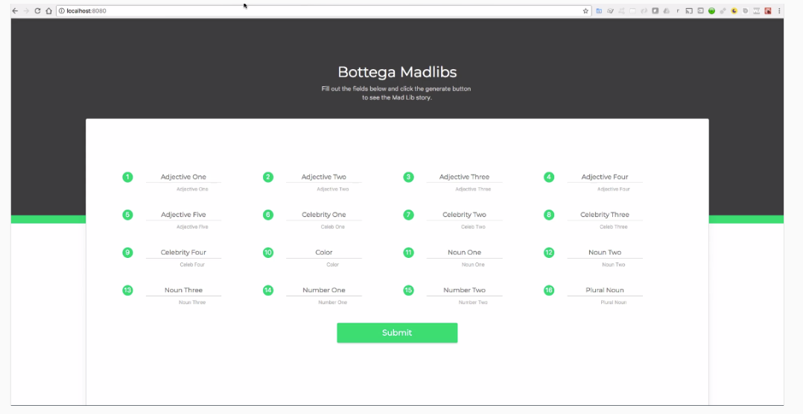

# REACT

## Introducción a React

React es una `biblioteca` de JavaScript utilizada para construir interfaces de usuario. Es importante destacar que, aunque a menudo se le llama "framework" debido a su poder y la forma en que se utiliza, técnicamente es una biblioteca debido a su ligereza.

React permite la creación de aplicaciones web modernas y poderosas mediante una metodología única en comparación con otros marcos web tradicionales como Rails o Django. En esta guía, vamos a explorar la arquitectura de React y cómo se utiliza para construir interfaces de usuario eficaces.

## Arquitectura Basada en Componentes

Una de las características fundamentales de React es su enfoque en componentes. Los componentes son entidades únicas y reutilizables que forman la base de cualquier aplicación React. Para entender mejor cómo funciona esto, veamos un ejemplo práctico:

## Ejemplo webs de Componentes 

### Facebook


En una página de Facebook, cada elemento visible puede ser considerado un componente. Por ejemplo:

- Una miniatura de imagen.
- Un enlace en la barra lateral.
- Un banner publicitario que puede cerrarse.

Cada uno de estos elementos es un componente independiente y reutilizable que se representa en la pantalla.

### Comparación con Enfoques Tradicionales

En sistemas tradicionales basados en frameworks como Rails, las aplicaciones se construyen mediante la creación de múltiples archivos HTML individuales. Cada página de la aplicación tiene su propio archivo HTML. Por ejemplo, una aplicación de portafolio en Rails tendría:


- Una página de inicio (`home.html`).
- Una página "Acerca de" (`about.html`).
- Una página de portafolio (`portfolio.html`).

En contraste, una aplicación React se basa en un único archivo HTML. Todos los componentes y datos de la aplicación se gestionan dentro de este archivo único, y los componentes se muestran o eliminan dinámicamente según sea necesario.

### Otro ejemplo: MadLibs

Para ilustrar cómo funciona React, consideremos una aplicación Mad Libs:



1. **Formulario de Entrada**: Un componente que solicita al usuario varios tipos de palabras (adjetivos, sustantivos, nombres de celebridades, etc.).
2. **Historia Generada**: Un componente que muestra la historia generada usando las palabras proporcionadas por el usuario.

Al enviar el formulario, las palabras se insertan en la historia y se muestra en la pantalla. Todos estos elementos se gestionan dentro de un único archivo HTML, y los componentes se cargan y descargan dinámicamente según las interacciones del usuario.

## Metodología de Desarrollo en React

Desarrollar aplicaciones en React implica un cambio de mentalidad si provienes de un entorno de desarrollo web tradicional. En lugar de construir múltiples páginas web estáticas, en React nos enfocamos en construir componentes granulares y detallados. Estos componentes se gestionan dinámicamente para proporcionar una experiencia de usuario fluida y reactiva.

## Instalación de Dependencias en Mac

Para comenzar a trabajar con React en un sistema Mac, es necesario instalar algunas dependencias esenciales. A continuación, se detallan los pasos para configurar el entorno de desarrollo.

#### Instalación de Homebrew

Homebrew es un gestor de paquetes que facilita la instalación de software en macOS. 

1. **Instalar Homebrew:**
   - Visita [brew.sh](https://brew.sh) y copia el script de instalación.
   - Abre la terminal (puedes encontrarla presionando `Comando + Barra espaciadora` y escribiendo "Terminal").
   - Pega y ejecuta el script en la terminal.

```bash
    /bin/bash -c "$(curl -fsSL https://raw.githubusercontent.com/Homebrew/install/HEAD/install.sh)"
```

2. **Verificar la instalación de Homebrew:**
   - Reinicia la terminal.
   - Ejecuta el comando `brew` para asegurarte de que Homebrew esté instalado correctamente.

#### Instalación de Xcode

Xcode es el IDE de Apple para macOS. No se utilizará directamente, pero muchas dependencias lo requieren.

1. **Instalar Xcode:**
   - Abre la App Store en tu Mac.
   - Busca "Xcode" y descárgalo.
   - Xcode es una descarga grande (aproximadamente 5.5 GB), así que ten paciencia mientras se instala.

#### Instalación de Node.js

Node.js es necesario para ejecutar React y gestionar sus paquetes.

1. **Instalar Node.js:**
   - Abre la terminal.
   - Usa Homebrew para instalar Node.js ejecutando el siguiente comando:

```bash
    brew install node
```

2. **Verificar la instalación de Node.js y npm:**
   - Verifica la versión de Node.js con `node -v`.
   - Verifica la versión de npm (Node Package Manager) con `npm -v`.

En caso de problemas con los permisos al verificar npm, sigue estos pasos:

1. **Resolver problemas de permisos:**
   - Si obtienes un error de verificación de actualización de npm, ejecuta el comando sugerido por el sistema para resolver los permisos.
   - El comando típico sería algo así:

```bash
    sudo chown -R $(whoami) $(npm config get prefix)/{lib/node_modules,bin,share}
```

2. **Verificar nuevamente npm:**
   - Después de resolver los permisos, verifica nuevamente con `npm -v`.

#### Resumen

Después de completar estos pasos, tendrás las herramientas necesarias instaladas en tu sistema para desarrollar aplicaciones React en macOS:

- **Homebrew:** Para gestionar paquetes de software.
- **Xcode:** Para satisfacer las dependencias necesarias.
- **Node.js y npm:** Para ejecutar React y gestionar paquetes de Node.

Con estas dependencias instaladas, estarás listo para comenzar a crear aplicaciones React en tu Mac.

## Instalación en Windows

### 1. Instalación de Node.js y npm

Node.js es un entorno de ejecución de JavaScript y npm es el gestor de paquetes de Node.js. Ambos son necesarios para trabajar con React.

1. **Descarga e instala Node.js**:
   - Ve al sitio web oficial de Node.js: [https://nodejs.org/](https://nodejs.org/).
   - Descarga el instalador recomendado (LTS) y sigue las instrucciones para instalarlo.

2. **Verifica la instalación**:
   - Abre tu terminal (cmd, PowerShell o la terminal integrada de VS Code) y ejecuta:
     ```bash
        node -v
        npm -v
     ```
   - Deberías ver los números de versión de Node.js y npm.

### 2. Instalación de Visual Studio Code (VSC)

Visual Studio Code es un editor de código fuente muy popular y compatible con muchas extensiones útiles para React.

1. **Descarga e instala VS Code**:
   - Ve al sitio web oficial de VS Code: [https://code.visualstudio.com/](https://code.visualstudio.com/).
   - Descarga el instalador y sigue las instrucciones para instalarlo.

### 3. Instalación de la Extensión de React para VS Code

Para mejorar tu experiencia de desarrollo con React en VS Code, instala la extensión de React.

1. **Abre VS Code**.
2. **Ve a la pestaña de extensiones** (icono de cuadrado en la barra lateral izquierda o presiona `Ctrl+Shift+X`).
3. **Busca "ES7 React/Redux/GraphQL/React-Native snippets"** y haz clic en "Instalar".
4. También es útil instalar la extensión "Prettier - Code formatter" para formatear tu código automáticamente.

### 4. Crear una Aplicación React
Ahora, puedes crear tu primera aplicación React usando `create-react-app`.

1. **Abre tu terminal** (puedes usar la terminal integrada en VS Code).
2. **Ejecuta el siguiente comando** para instalar `create-react-app` globalmente:
   ```bash
   npm install -g create-react-app
   ```
3. **Crea una nueva aplicación React**:
   ```bash
   npx create-react-app nombre-de-tu-aplicacion
   ```
   Reemplaza `nombre-de-tu-aplicacion` con el nombre que desees para tu proyecto.
4. **Navega al directorio del proyecto**:
   ```bash
   cd nombre-de-tu-aplicacion
   ```
5. **Inicia la aplicación**:
   ```bash
   npm start
   ```

### 5. Configuración Adicional (Opcional)
- **Configurar Prettier**: Asegúrate de que tu código se formatee automáticamente. Crea un archivo `.prettierrc` en la raíz de tu proyecto con las configuraciones deseadas, por ejemplo:
  ```json
  {
    "semi": true,
    "singleQuote": true,
    "trailingComma": "all"
  }
  ```
- **Instalar ESLint**: Para mantener un código limpio y libre de errores. Instala las dependencias necesarias:
  ```bash
  npm install eslint eslint-plugin-react eslint-plugin-react-hooks --save-dev
  ```
  Luego, crea un archivo `.eslintrc.json` en la raíz del proyecto:
  ```json
  {
    "extends": ["react-app"],
    "plugins": ["react", "react-hooks"]
  }
  ```

¡Con estos pasos, tu terminal de Windows y Visual Studio Code estarán preparados para desarrollar aplicaciones con React!

## Crear un proyecto a partir de una plantilla creada con las dependencias mínimas necesarias

Para desarrollar aplicaciones React, se necesitan varias herramientas y dependencias. Aunque ya tienes Node.js y npm, configurar todo el entorno puede ser complicado. Para simplificar esto, se ha creado un módulo npm específico para este curso: **DevCamp JavaScript Project Builder**. Esto permite configurar rápidamente un entorno de desarrollo React sin preocuparse por las configuraciones detalladas.

### Instalación de DevCamp JavaScript Project Builder

1. **Instalar el módulo:**
   - Abre la terminal y ejecuta el siguiente comando:
     ```bash
     npm install devcamp-js-builder -g
     ```
   - Si encuentras problemas de permisos, usa:
     ```bash
     sudo npm install devcamp-js-builder -g
     ```
   - Si es necesario, añade el flag `-f`:
     ```bash
     sudo npm install devcamp-js-builder -g -f
     ```

2. **Verificar la instalación:**
   - En cualquier directorio, ejecuta:
     ```bash
     js-generate
     ```
   - Esto mostrará las plantillas de proyecto disponibles. Elige una plantilla para generar un proyecto React, por ejemplo, `react-bootstrap`.

### Creación de un Proyecto

1. **Generar un proyecto:**
   - Ejecuta `js-generate` y selecciona `react-bootstrap`.
   - Nombra tu proyecto,  `AquiNombreProyecto`.
   
2. **Instalar dependencias del proyecto:**
   - Navega al directorio del proyecto generado.
   - Ejecuta:
     ```bash
     npm install
     ```
   - Esto instalará todas las dependencias listadas en el proyecto.

### Verificación y Ejecución del Proyecto

1. **Verificar la instalación:**
   - Asegúrate de que las dependencias estén correctamente instaladas ejecutando:
     ```bash
     npm start
     ```
   - Esto iniciará el servidor de desarrollo y deberías ver tu aplicación en `localhost:8080`.

2. **Editar y comprobar cambios:**
   - Abre el archivo `src/components/app.js` en tu editor de texto.
   - Realiza un cambio, por ejemplo, agrega un texto "Mi aplicación de prueba".
   - Guarda el archivo y verifica que el cambio se refleje en el navegador.

## Resumen del Proceso de Configuración de React con React-Redux-Router

### Instalación y Configuración Inicial

1. **Crear Directorio para el Proyecto:**
   - Elige un directorio donde deseas almacenar tu proyecto. Puedes usar cualquier ubicación en tu sistema, ya sea Mac, Linux o Windows.

2. **Verificar la Instalación de JS Builder:**
   - Asegúrate de tener el módulo `JS Builder` instalado ejecutando el comando `js-generate`. Si funciona correctamente, debería mostrar una lista de plantillas de proyectos.

3. **Generar el Proyecto:**
   - Selecciona la plantilla `react-redux-router` usando las teclas de flecha y presiona Enter.
   - Asigna un nombre al proyecto, por ejemplo, `jordan-hudgens-react-portfolio`.
   - Esto generará un proyecto completo con la estructura necesaria.

4. **Navegar al Proyecto:**
   - Usa el comando `cd` para moverte al directorio del proyecto recién creado.
   - Opcionalmente, puedes abrir el explorador de archivos para ver los archivos generados.

5. **Abrir el Proyecto en el Editor de Texto:**
   - Abre tu editor de texto (VS Code recomendado) y carga el proyecto generado.

### Instalación de Dependencias

1. **Instalar Dependencias del Proyecto:**
   - En la terminal, ejecuta `npm install` para instalar todas las dependencias listadas en el archivo `package.json`.
   - Esto creará un directorio `node_modules` con todas las bibliotecas necesarias.

2. **Solución del Error del Compilador `node-sass`:**
   - Antes de instalar las dependencias, ejecuta los siguientes comandos en la terminal:
     ```bash
     npm uninstall node-sass
     npm install sass
     ```
   - Luego, procede con la instalación de las dependencias usando `npm install`.

### Verificación y Ejecución del Proyecto

1. **Iniciar el Proyecto:**
   - Ejecuta `npm run start` para iniciar el servidor de desarrollo local.
   - Esto compilará el proyecto y lo ejecutará en `localhost:3000`.

2. **Verificar Funcionamiento:**
   - Abre tu navegador y navega a `localhost:3000`. Deberías ver una página con el texto "DevCamp React Starter React Redux Router".
   - Puedes editar el contenido del archivo `src/components/App.js` para verificar los cambios. Por ejemplo, cambia el texto dentro de la etiqueta `<h1>` y guarda el archivo. La página se actualizará automáticamente con los cambios.

### Exploración y Modificación del Proyecto

1. **Explorar el Sistema de Archivos:**
   - Navega a través de los archivos en el directorio `src` para familiarizarte con la estructura del proyecto.
   - Los componentes principales y configuraciones se encuentran en este directorio.

2. **Realizar Cambios:**
   - Abre `src/components/App.js` y modifica el contenido para personalizar el proyecto. Guarda los cambios y verifica que se reflejen en el navegador.

## Añadir, eliminar y administrar Modulos de nodo

### Exploración y Modificación del Proyecto

1. **Estructura del Proyecto:**
   - `node_modules`: Lista de todas las bibliotecas instaladas.
   - `src`: Contiene los archivos fuente de la aplicación.
   - `package.json`: Lista de dependencias y scripts del proyecto.

2. **Agregar una Nueva Biblioteca Manualmente:**
   - Abre `package.json` y agrega la dependencia:
     ```json
     "moment": "2.22.2"
     ```
   - Instala la nueva biblioteca:
     ```bash
     npm install
     ```

3. **Usar una Biblioteca Externa en React:**
   - Importa la biblioteca en tu componente:
     ```javascript
     import moment from 'moment';
     ```
   - Usa la biblioteca en el código:
     ```javascript
     <div>{moment().format('MMMM Do YYYY, h:mm:ss a')}</div>
     ```

### Eliminación de Bibliotecas

1. **Eliminar Bibliotecas Innecesarias:**
   - Elimina las dependencias de `package.json`:
     ```json
     "jquery": "^3.5.1",
     "bootstrap": "^4.5.0",
     "popper.js": "^1.16.1"
     ```
   - Ejecuta el comando para sincronizar las dependencias:
     ```bash
     npm install
     ```

2. **Reinstalar `node_modules` si es necesario:**
   - Elimina el directorio `node_modules`:
     ```bash
     rm -rf node_modules
     ```
   - Reinstala las dependencias:
     ```bash
     npm install
     ```

## Añadir dependencias a través del terminal

1. **Comando para Instalar una Dependencia:**
   - Abre la terminal.
   - Usa el comando:
     ```bash
     npm install moment
     ```
   - Este comando descargará e instalará la última versión de "moment" y la añadirá automáticamente a `package.json`.

2. **Verificación:**
   - Abre `package.json` y verifica que "moment" esté listado en las dependencias.
   - Asegúrate de que "moment" esté en orden alfabético.

3. **Confirmación en `node_modules`:**
   - En Visual Studio Code, actualiza el explorador de archivos.
   - Navega a `node_modules` y verifica que "moment" esté presente.

### Resumen de Pasos

1. **Eliminar una Dependencia:**
   - Eliminar línea en `package.json`.
   - Ejecutar `npm install` en la terminal.

2. **Agregar una Dependencia Automáticamente:**
   - Ejecutar `npm install nombre_dependencia` en la terminal.

3. **Verificar Cambios:**
   - Confirmar cambios en `package.json`.
   - Verificar la presencia de la dependencia en `node_modules`.

### Código para Referencia

#### Eliminar "moment" del `package.json`
```json
{
  "dependencies": {
    // otras dependencias
    // "moment": "2.22.2" <-- Eliminar esta línea
  }
}
```

#### Agregar "moment" usando npm
```bash
npm i moment
```

### Conclusión

Estas instrucciones muestran cómo eliminar y agregar dependencias en una aplicación React, lo que es esencial para mantener el proyecto limpio y actualizado. La forma automatizada de agregar dependencias es preferible, ya que asegura que siempre se utilice la versión más reciente y que las dependencias estén correctamente ordenadas en `package.json`.

## Descripción General del Directorio `src` en una Aplicación React

El directorio `src` (abreviatura de "source" o "fuente") es el núcleo de tu aplicación React. Contiene toda la lógica y el código que defines para tu aplicación, mientras que otros archivos en la raíz del proyecto suelen ser configuraciones y dependencias. A continuación, se presenta una descripción general de los componentes principales dentro del directorio `src`:

### Acciones y Reductores

- **Acciones (`actions/`)**: Permiten interactuar con la tienda de Redux. Redux se utiliza para gestionar el estado global de la aplicación, almacenando todos los datos en un solo lugar y permitiendo acceder a ellos desde cualquier componente.
- **Reductores (`reducers/`)**: Son funciones que especifican cómo cambia el estado de la aplicación en respuesta a una acción. Trabajan conjuntamente con las acciones y son una parte integral de Redux.

### Componentes

- **Componentes (`components/`)**: Son los bloques básicos de construcción en una aplicación React. Cada componente representa una parte específica de la interfaz de usuario y puede ser tan pequeño como un botón o tan grande como una página completa.
  - **Componente de Aplicación**: El componente principal que anida todos los demás componentes de la aplicación. Este componente suele estar en `App.js` y sirve como punto de entrada para el resto de los componentes.

### Estilos

- **Estilos (`styles/`)**: Contiene archivos CSS y SCSS que definen la apariencia de la aplicación. Mantener los estilos en un directorio separado facilita su gestión y organización.
  - **Main.scss**: Archivo de entrada principal para los estilos de la aplicación. Importa otros archivos de estilo, permitiendo una gestión centralizada de los estilos.

### Bootstrap.js

- **Bootstrap.js**: Actúa como el punto de inicio de la aplicación. Configura React, Redux, el enrutador y cualquier otra biblioteca necesaria, y luego inicia la aplicación. Importa el componente de la aplicación y cualquier otro archivo necesario para inicializar la aplicación.

### Proveedor

- **Proveedor (`provider.js`)**: Proporciona polyfills y configuraciones necesarias para que el código moderno de JavaScript funcione en todos los navegadores. Utiliza Babel para convertir el código moderno en una sintaxis que los navegadores puedan entender.

### Flujo General de Inicialización

1. **Punto de Entrada**: El archivo HTML principal (`index.html`) contiene un div con la clase `app-wrapper`.
2. **Carga de Bootstrap.js**: `Bootstrap.js` carga React, Redux y otras bibliotecas necesarias. Selecciona el div `app-wrapper` del HTML y inyecta el componente de la aplicación dentro de él.
3. **Renderizado del Componente de Aplicación**: El componente de aplicación (`App.js`) sirve como contenedor principal para todos los demás componentes de la aplicación.
4. **Gestión de Estado con Redux**: Redux se configura para gestionar el estado global de la aplicación, con acciones y reductores definiendo cómo se actualiza y mantiene el estado.
5. **Estilos**: Los estilos CSS y SCSS se importan a través de `Main.scss`, proporcionando una apariencia cohesiva a la aplicación.

### Resumen

El directorio `src` es el corazón de tu aplicación React, conteniendo todos los componentes, estilos y lógica necesarios para construir y mantener la aplicación. Al estructurar y organizar este directorio de manera clara y eficiente, se facilita el desarrollo y mantenimiento del proyecto. A medida que avances en el curso, te familiarizarás con cada uno de estos elementos y aprenderás a utilizarlos de manera efectiva en tus propias aplicaciones.