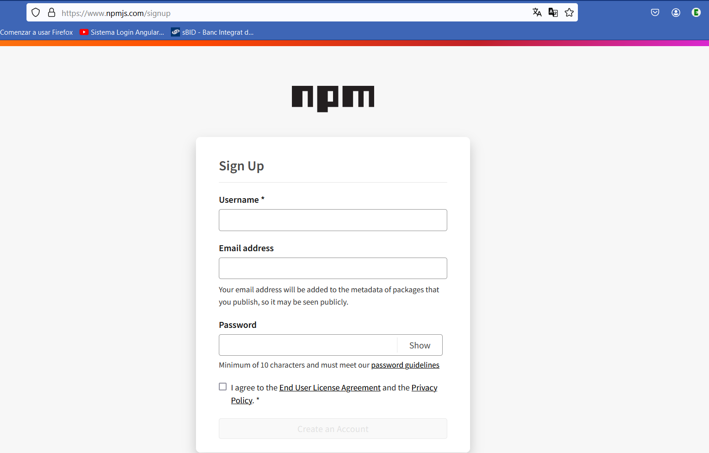

### Requisitos necesarios

- Registrarse en npmjs.com
- Estar registrado en gitHub. (Explicado en manual de GitHub)
- Comprobar que tengo instalado node y npm.
- Configurar editor de texto, en este caso Visual Studio Code.


### 1. Inscripción en npmjs.com

Antes de comenzar, necesitas tener una cuenta en [npmjs.com](https://www.npmjs.com/signup). Si aún no tienes una, regístrate para obtener una cuenta gratuita.




### 2. Comprobar que tengo instalado node y npm.

Abre una terminal o línea de comandos y ejecuta el siguiente comando para comprobar si node está instalado nos dará la versión:

```
    node -v
```
Si no lo tenemos instalado:

 **Instalación de Node.js**: Si aún no tienes Node.js instalados en tu sistema, descárgalos e instálalos desde [nodejs.org](https://nodejs.org).

Abre una terminal o línea de comandos y ejecuta el siguiente comando para comprobar si npm lo tenemos instadado. Por regla general si tenemos instalado node, instala también npm:

```
    npm -v
```
Si no lo tenemos instalado:

```
    npm install
```


2. **Inicialización del Proyecto**: Crea un nuevo directorio para tu proyecto y ejecuta el siguiente comando para inicializar un nuevo proyecto npm:

```bash
   npm init
```

